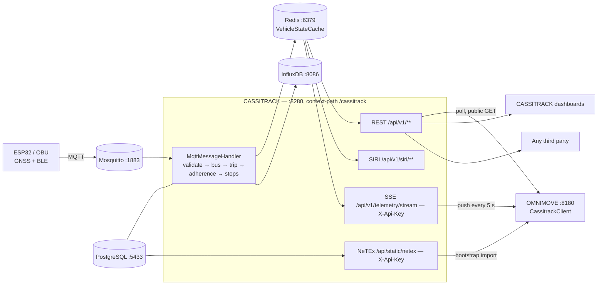

# Integrating with CASSITRACK

**Audience:** students working on the CASSITRACK / OMNIMOVE challenge.
**Goal:** how an *external consumer* obtains fleet and bus data from CASSITRACK, with OMNIMOVE as the
reference implementation.

Everything below comes from the code in `cassitrack-backend/` and from the real consumer
`omnimove-backend/.../client/CassitrackClient.java`. If an API is not listed here, it does not exist.

---

## 1. Overview

CASSITRACK is the **data provider** of the ecosystem. Buses (ESP32 / OBU units) publish raw GPS and
telemetry over MQTT; CASSITRACK enriches every fix server-side (which trip, which route, last/next
stop, delay, crowding), keeps live state in Redis, writes history to InfluxDB, and re-publishes the
result through four surfaces:

| Surface | Format | Typical consumer |
|---|---|---|
| REST `/api/v1/**` | JSON | apps, dashboards, OMNIMOVE journey planning |
| SIRI `/api/v1/siri/vehicle-monitoring` | XML (SIRI 2.0) | transit-standard consumers |
| NeTEx `/api/static/netex` | XML (NeTEx) | one-shot import of the static network |
| SSE `/api/v1/telemetry/stream` | `text/event-stream` carrying SIRI XML | OMNIMOVE live sync |

Key principle: **the bus reports only what it can measure**. Trip, route, current stop, delay and
crowding are *derived by CASSITRACK*, never trusted from the payload — so you receive already-resolved
operational data and should not recompute it.



**Local base URL:** `http://localhost:8280/cassitrack` (`server.port: 8280`,
`server.servlet.context-path: /cassitrack`). Behind Nginx the prefix is preserved:
`http://193.205.60.151:8280/cassitrack`.

---

## 2. Authentication

### 2.1 What actually needs a token

Most of what a consumer needs is **public**. From `SecurityConfig`:

* `permitAll()` on GET: `/api/v1/vehicles/**`, `/stops/**`, `/routes/**`, `/siri/**`, `/journeys/**`,
  `/telemetry/latest`, `/telemetry/stream`; also `/api/static/**` (but the controller enforces an API key).
* Everything else is `authenticated()`. `/api/v1/buses/**` and `/api/v1/analytics/**` require
  `FLEET_MANAGER`; `/api/v1/users/**` requires `ADMIN`; `/api/v1/ai/**` accepts either.

So there are **two separate credentials**: a **JWT** (management/analytics endpoints, Swagger UI) and
an **API key** `X-Api-Key` (SSE stream, NeTEx export).

### 2.2 Obtaining and using a JWT

`POST /api/v1/auth/login` (`AuthController`), body = `LoginRequest {email, password}`:

```bash
TOKEN=$(curl -s -X POST http://localhost:8280/cassitrack/api/v1/auth/login \
  -H 'Content-Type: application/json' \
  -d '{"email":"manager@cassitrack.it","password":"<your-password>"}' | jq -r .token)

curl -s http://localhost:8280/cassitrack/api/v1/analytics/summary -H "Authorization: Bearer $TOKEN"
```

Response body (`LoginResponse`):

```json
{ "token": "eyJhbGciOiJIUzI1NiJ9...", "username": "manager@cassitrack.it",
  "email": "manager@cassitrack.it", "role": "FLEET_MANAGER" }
```

The same token is *also* set as `Set-Cookie: cassitrack_jwt=<token>; Path=/; Max-Age=3600; HttpOnly;
SameSite=Strict`. Browser pages use the cookie (JS cannot read it); server-to-server clients use the
body token.

* **Algorithm / lifetime:** HS256, `jwt.expiration-ms: 3600000` → **1 hour**. There is **no refresh
  token** — re-login on expiry.
* **Roles** (free-text `users.role`): `ADMIN`, `FLEET_MANAGER`. Seeded in `V2`: `admin@cassitrack.it`,
  `manager@cassitrack.it`.
* **Brute force:** 5 failed attempts / 15 min → HTTP **429** + `ACCOUNT_LOCKED` audit event.
* `JwtAuthenticationFilter` reads the **cookie first**, then `Authorization: Bearer`.
* `POST /api/v1/auth/logout` blacklists the token in Redis and returns **204**.

### 2.3 The API key

`SSE_API_TOKEN` (CASSITRACK) must equal `CASSITRACK_API_TOKEN` (consumer). Compared in constant time
(`MessageDigest.isEqual`). Wrong/missing → **401** on `/telemetry/stream`, **403** on `/api/static/netex`.

---

## 3. REST catalogue for consumers

All paths relative to `http://localhost:8280/cassitrack`.

### 3.1 Live vehicles — `VehicleController`

| Method | Path | Auth | Returns |
|---|---|---|---|
| GET | `/api/v1/vehicles` | public | `VehicleStatusDTO[]` — active vehicles (GPS seen ≤ 300 s ago) |
| GET | `/api/v1/vehicles/{id}` | public | one `VehicleStatusDTO`, **404** if unknown/stale |
| GET | `/api/v1/vehicles/count` | public | `{"active":3,"total":4}` |
| GET | `/api/v1/vehicles/fleet-size` | public | `{"total":4}` (rows in `buses`) |

```bash
curl -s http://localhost:8280/cassitrack/api/v1/vehicles | jq '.[0]'
```

```json
{
  "vehicle_id": "BUS1", "map_visible": true,
  "busId": 1, "numeroPosti": 50, "wheelchairAccessible": true,
  "lat": 41.4925, "lon": 13.8306, "speed_kmh": 27.4, "heading_deg": 142.0,
  "route_id": "LINEA_A_OUT", "route_name": "P.za San Benedetto → Università Folcara",
  "trip_id": "LINEA_A_OUT-0730",
  "schedule_status": "SLIGHTLY_LATE", "delay_minutes": 4,
  "delay_stop_name": "Staz. FF.SS.", "delay_stop_sequence": 5,
  "delay_measured_at": "2026-08-03T07:41:12Z",
  "last_stop_id": "SFF", "last_stop_name": "Staz. FF.SS.",
  "next_stop_id": "VBO", "next_stop_name": "Viale Bonomi", "eta_seconds": 180,
  "estimated_passengers": 21, "crowding_level": "MEDIUM", "occupancy_pct": 42,
  "timestamp": "2026-08-03T07:43:02Z", "last_seen": "2026-08-03T07:43:03Z",
  "is_active": true
}
```

Details that bite:

* `vehicle_id` is the **radio identity** (`buses.current_vehicle_id`), not the plate. After migration
  `V11` the on-board units transmit `BUS1`, `BUS2`, `BUS2L`, `BUS3`; `MAGNI-00x` are registry labels.
* `schedule_status` ∈ `ON_TIME | SLIGHTLY_LATE | SIGNIFICANTLY_LATE | EARLY | UNKNOWN`.
* `crowding_level` ∈ `LOW | MEDIUM | HIGH | VERY_HIGH`, `null` when passengers are unknown.
* `delay_minutes` is signed: positive = late, negative = early.
* Naming is **mixed**: mostly snake_case, but `busId`, `numeroPosti`, `wheelchairAccessible` are
  camelCase (no `@JsonProperty`). Map them explicitly.

### 3.2 Stops and arrivals — `StopController`

| Method | Path | Auth | Returns |
|---|---|---|---|
| GET | `/api/v1/stops` | public | all stops (raw `Stop` records) |
| GET | `/api/v1/stops/{stopId}/arrivals` | public | `StopArrivalDTO[]` — **live** GPS predictions |
| GET | `/api/v1/stops/{stopId}/schedule` | public | `StopArrivalDTO[]` — today's remaining **timetable** |
| POST/PUT/DELETE | `/api/v1/stops[/{id}]` | FLEET_MANAGER | CRUD |

Real stop IDs (`V4`): `PSB` Piazza San Benedetto, `CRS` C.so Repubblica, `VLE` V.le Europa,
`VGA` Via Garigliano, `SFF` Staz. FF.SS., `VBO` Viale Bonomi, `UNI` Università Folcara,
`LIC` Liceo Scientifico, `OSP` Ospedale.

```bash
curl -s http://localhost:8280/cassitrack/api/v1/stops/UNI/arrivals | jq '.[0]'
```

```json
{
  "vehicle_id": "BUS1", "trip_id": "LINEA_A_OUT-0730",
  "route_id": "LINEA_A_OUT", "route_name": "P.za San Benedetto → Università Folcara",
  "route_short_name": "A", "crowding_level": "MEDIUM",
  "scheduled_arrival": "2026-08-03T07:45:00Z", "estimated_arrival": "2026-08-03T07:49:00Z",
  "delay_minutes": 4, "schedule_status": "SLIGHTLY_LATE", "delay_stop_name": "Staz. FF.SS."
}
```

`/schedule` returns the same shape but with `vehicle_id: null`, `delay_minutes: 0` and
`schedule_status: "SCHEDULED"` — static timetable, not a prediction. `stopId` is validated against
`^[A-Za-z0-9\-_]{1,50}$`; a bad id returns **400**.

### 3.3 Routes and geometry — `RouteController`

`GET /api/v1/routes` (public) returns active routes with ordered stops **and** the street-following
polyline; `GET /api/v1/routes/manage` returns raw `Route` rows; POST/PUT/DELETE need FLEET_MANAGER.

```bash
curl -s http://localhost:8280/cassitrack/api/v1/routes | jq '.[0] | {id,name,longName,color,stops:.stops[0:2],path:.path[0:2]}'
```

```json
{
  "id": "LINEA_A_OUT", "name": "A",
  "longName": "P.za San Benedetto → Università Folcara", "color": "1976D2",
  "stops": [ { "id": "PSB", "name": "Piazza San Benedetto", "lat": 41.4925, "lon": 13.8306 },
             { "id": "CRS", "name": "C.so Repubblica", "lat": 41.4912, "lon": 13.8321 } ],
  "path":  [ { "lat": 41.4925, "lon": 13.8306 }, { "lat": 41.4921, "lon": 13.8312 } ]
}
```

`path` (from `route_shapes`) may be an **empty array** for routes without geometry — then draw
`stops` instead. Only routes with ≥ 2 resolvable stops appear.

### 3.4 SIRI — `SiriController`

```bash
curl -s 'http://localhost:8280/cassitrack/api/v1/siri/vehicle-monitoring?route_id=LINEA_A_OUT'
```

```xml
<Siri xmlns="http://www.siri.org.uk/siri" version="2.0"><ServiceDelivery>
  <ProducerRef>CASSITRACK</ProducerRef>
  <VehicleMonitoringDelivery version="2.0"><Status>true</Status>
    <VehicleActivity>
      <RecordedAtTime>2026-08-03T07:43:02.000Z</RecordedAtTime>
      <ValidUntilTime>2026-08-03T07:44:02.000Z</ValidUntilTime>
      <MonitoredVehicleJourney>
        <FramedVehicleJourneyRef><DataFrameRef>2026-08-03</DataFrameRef>
          <DatedVehicleJourneyRef>LINEA_A_OUT-0730</DatedVehicleJourneyRef></FramedVehicleJourneyRef>
        <VehicleLocation><Longitude>13.8306</Longitude><Latitude>41.4925</Latitude></VehicleLocation>
        <Bearing>142.0</Bearing><Occupancy>seatsAvailable</Occupancy><Delay>PT4M</Delay>
        <VehicleRef>BUS1</VehicleRef>
        <PreviousCalls><PreviousCall><StopPointRef>SFF</StopPointRef>
          <StopPointName>Staz. FF.SS.</StopPointName></PreviousCall></PreviousCalls>
        <MonitoredCall><StopPointRef>VBO</StopPointRef><StopPointName>Viale Bonomi</StopPointName>
          <VehicleAtStop>false</VehicleAtStop></MonitoredCall>
      </MonitoredVehicleJourney>
      <Extensions><Velocity>27.4</Velocity><NumberOfSeats>50</NumberOfSeats>
        <Passengers>21</Passengers><WheelchairAccess>true</WheelchairAccess></Extensions>
    </VehicleActivity>
  </VehicleMonitoringDelivery>
</ServiceDelivery></Siri>
```

`Delay` is an ISO-8601 duration (`PT0S`, `PT4M`, `-PT1M`). `Occupancy` uses the SIRI vocabulary
(`empty | manySeatsAvailable | seatsAvailable | fewSeatsAvailable | standingAvailable | full`).
Speed, seats, passengers and wheelchair access live in the non-standard `<Extensions>` element
**at `VehicleActivity` level**, not inside `MonitoredVehicleJourney`.

### 3.5 NeTEx — `NetexController` (static network, API key)

```bash
curl -s -H "X-Api-Key: $SSE_API_TOKEN" \
  http://localhost:8280/cassitrack/api/static/netex -o netex.xml
```

Returns a full `PublicationDelivery` (SiteFrame with `StopPlace`s, ServiceFrame with lines,
TimetableFrame with journeys, ResourceFrame with vehicles, plus shapes). IDs are namespaced
`CASSITRACK:<Type>:<localId>`, e.g. `CASSITRACK:StopPlace:PSB`; times are `HH:mm:ss`. Use it **once
at bootstrap**, then stay fresh via the live channels.

### 3.6 Telemetry (deprecated) and role-gated endpoints

* `GET /api/v1/telemetry/latest?route_id=LINEA_A_OUT` — public, reads InfluxDB, `BusTelemetryDTO[]`
  with **camelCase** fields (`busId, latitude, longitude, speed, bleDeviceCount, timestamp, delay,
  lastStopRegistered, tripId, passengers, capacity, nextStop`). Marked **DEPRECATED** in the code.
* `GET /api/v1/buses` (`?search=&status=&routeId=`), `/{id}`, `/route-options` — **FLEET_MANAGER**.
  Static registry (`BusDTO`: `busId, targa, numeroPosti, wheelchairAccessible, status, routeId,
  routeName, mapVisible, currentVehicleId`), *not* live telemetry.
* `GET /api/v1/analytics/{summary,adherence,busiest-hours,passengers-by-route,delay-by-route,co2,
  operating-hours,routes,routes-map}` — **FLEET_MANAGER**. Filter params are regex-validated.
* `POST /api/v1/ai/chat` — FLEET_MANAGER or ADMIN.
* Swagger UI `/cassitrack/api/swagger-ui` and OpenAPI JSON `/cassitrack/api/docs` — **auth required**.

---

## 4. Real-time channel

> **Read carefully.** The `spring-boot-starter-websocket` dependency, the property
> `spring.websocket.stomp.endpoint: /ws/vehicles` and a `permitAll()` rule for `/ws/**` all exist —
> but there is **no `@EnableWebSocketMessageBroker` configuration class in the codebase**. No STOMP
> broker, no `/ws/vehicles` handler. Do not build against it. The real push channel is **SSE**.

### 4.1 SSE stream — `GET /api/v1/telemetry/stream`

* `Content-Type: text/event-stream`, emitter timeout `-1` (never expires server-side).
* Requires `X-Api-Key: <SSE_API_TOKEN>`, otherwise **401** with an empty body.
* Capacity: **50 concurrent emitters**; the 51st connection gets **429**.
* Two frame types: every **5 s** an `event: telemetry-update` whose `data:` is a complete SIRI
  `<Siri>` document built from the Redis cache (same shape as §3.4, all active vehicles); every
  **3 s** an SSE comment `:keepalive` holding the TCP connection open.
* It is a **snapshot** feed, not a delta feed: every push carries the whole active fleet, so a
  consumer that misses frames simply resyncs on the next one.

```bash
curl -N -H "X-Api-Key: $SSE_API_TOKEN" http://localhost:8280/cassitrack/api/v1/telemetry/stream
```

```
:keepalive

event:telemetry-update
data:<Siri xmlns="http://www.siri.org.uk/siri" version="2.0"><ServiceDelivery>...</ServiceDelivery></Siri>
```

The XML arrives as a **single `data:` line**, so handle it as a string payload, not JSON. When no
client is connected the scheduler does nothing (`if (emitters.isEmpty()) return;`).

### 4.2 Reconnection advice

The server never closes the stream deliberately, but proxies, restarts and network hiccups will.
Do what OMNIMOVE does: subscribe once at application start and **retry indefinitely with a fixed
5-second delay**; treat each reconnection as a clean resync (there is no cursor and no
`Last-Event-ID` support server-side); filter on the event name `telemetry-update` and ignore
keepalive comments; and keep a fallback — if the stream is down, poll `GET /api/v1/vehicles`
(public, no key), which is what the CASSITRACK dashboards do every **15 s** (`REFRESH = 15000`).

---

## 5. Case study — OMNIMOVE

OMNIMOVE (port **8180**, context-path `/omnimove`) consumes CASSITRACK through **three independent
paths**. This is the pattern third parties should copy.

### 5.1 Configuration

```yaml
# omnimove-backend/src/main/resources/application.yml
cassitrack:
  api:
    base-url: ${CASSITRACK_URL:http://localhost:8280/cassitrack/api/v1}
    token:    ${CASSITRACK_API_TOKEN}
  netex:
    url:      ${CASSITRACK_NETEX_URL:http://localhost:8280/cassitrack/api/static/netex}
```

The base URL already includes `/api/v1`, so client code uses short relative URIs (`/vehicles`,
`/stops/{id}/arrivals`). `CASSITRACK_API_TOKEN` must equal CASSITRACK's `SSE_API_TOKEN`.

### 5.2 Pull path — `CassitrackClient` (public REST, no auth)

A single `@Component` wrapping a WebFlux `WebClient` and — per its javadoc — *the only way OMNIMOVE
accesses fleet data: no shared database, no imports from cassitrack-backend*.

| Method | Calls | Used by |
|---|---|---|
| `getActiveVehicles()` | `GET /vehicles` → `VehicleDTO[]` | `JourneyPlannerService` (crowding on legs), `TrafficAwareETAService` (live-speed ETA), `AiOrchestrationService`, `JourneyController` |
| `getArrivalsAtStop(stopId)` | `GET /stops/{stopId}/arrivals` | live departure boards, journey legs |
| `getScheduleAtStop(stopId)` | `GET /stops/{stopId}/schedule` | timetable fallback when nothing is live |
| `isAvailable()` | `GET /vehicles` as a liveness probe | `JourneyPlannerService` sets `realtimeAvailable` |

Every method is wrapped in try/catch and **returns an empty list on failure**, logging a warning.
That is the load-bearing design decision: if CASSITRACK is down, OMNIMOVE still plans journeys, just
without live data. Copy this behaviour.

The mapping is deliberately **narrow**: `it.unicas.omnimove.dto.VehicleDTO` declares only seven
fields (`vehicle_id`, `lat`, `lon`, `speed_kmh`, `schedule_status`, `crowding_level`,
`estimated_passengers`) with matching `@JsonProperty` names; everything else CASSITRACK sends is
ignored by Jackson. Consume what you need, not the whole payload — it makes you immune to new fields.

### 5.3 Push path — `TelemetrySyncService` (SSE + API key)

On `ApplicationReadyEvent` it opens the SIRI stream and never lets go:

```java
webClient.get().uri("/telemetry/stream")
    .header("X-Api-Key", cassitrackApiToken)
    .retrieve()
    .bodyToFlux(new ParameterizedTypeReference<ServerSentEvent<String>>() {})
    .filter(event -> "telemetry-update".equals(event.event()))
    .retryWhen(Retry.fixedDelay(Long.MAX_VALUE, Duration.ofSeconds(5)))
    .subscribe(...);
```

Each frame is parsed with `XmlMapper` into OMNIMOVE's own `Siri` DTO, converted to `BusTelemetryDTO`
(`siriToDto`) and fanned out to its **own** stores: Redis (`bus:latest:{vehicleId}`) and its own
InfluxDB (`vehicle_position`). Delay is decoded from ISO-8601 (`PT2M` → 2); wheelchair access from
`Extensions/WheelchairAccess` with a fallback to the legacy `<Accessibility>`; `trip_id` from
`FramedVehicleJourneyRef/DatedVehicleJourneyRef`; next stop from `MonitoredCall/StopPointName`;
last stop from the first `PreviousCall`.

### 5.4 Bootstrap path — `NetexImportService`

`GET {cassitrack.netex.url}` with `X-Api-Key`, deserialised into `PublicationDeliveryDTO`, then
replayed into OMNIMOVE's own PostgreSQL (stops, routes, trips, scheduled stops, buses). It is a
**replace-all** import that deletes previous data first, and **aborts without destroying anything if
CASSITRACK returns nothing** — the same graceful-degradation reflex.

### 5.5 The lesson

| Data | Channel | Cadence | Auth |
|---|---|---|---|
| Static network (stops, lines, timetable) | NeTEx REST | bootstrap / on demand | `X-Api-Key` |
| Live positions | SSE SIRI | push, every 5 s | `X-Api-Key` |
| Query-driven live data (arrivals, crowding) | JSON REST | on request | none |

Never share a database with CASSITRACK. The HTTP contract is the whole interface.

---

## 6. Integration checklist for a new consumer

1. **Environment** — define at least `CASSITRACK_URL=http://localhost:8280/cassitrack/api/v1` and,
   for the push/NeTEx channels, `CASSITRACK_API_TOKEN=<same as CASSITRACK's SSE_API_TOKEN>`. Never
   hardcode the host: it differs between localhost and `193.205.60.151`.
2. **Credentials** — ask the CASSITRACK team for (a) the API key and (b) a user account *only* if you
   need FLEET_MANAGER/ADMIN endpoints. Public reads need nothing.
3. **Browser clients** — your origin must be added to `CORS_ALLOWED_ORIGINS` on the CASSITRACK side.
   Allowed methods GET/POST/PUT/DELETE/OPTIONS, allowed headers `Authorization, Content-Type, Accept,
   X-Api-Key`, `allowCredentials=false` — so the JWT cookie will **not** travel cross-origin; use the
   `Authorization` header.
4. **Rate limits** — there is no general REST rate limiter. The real caps are **50 concurrent SSE
   emitters** and **5 failed logins / 15 min per email**. Be a good citizen: poll `/vehicles` no
   faster than the dashboards (**15 s**); the data only changes when MQTT messages arrive.
5. **Error handling** — expect `200` with an empty array (nothing active, normal at night), `400`
   (invalid `stopId`), `401` (missing/wrong `X-Api-Key`, or expired JWT), `403` (wrong API key on
   NeTEx, or insufficient role), `404` (unknown vehicle/stop/route), `409` (delete blocked by
   references), `429` (login lockout or SSE capacity), `5xx`/timeouts (treat as "no live data", never
   fatal). Wrap every call, default to an empty result, log — the `CassitrackClient` pattern.
6. **Staleness** — a vehicle disappears from `/vehicles` after **300 s** without a GPS fix. Still
   check `last_seen` and `is_active` before showing a position, and respect `map_visible`
   (`false` = the operator hid this bus from public maps).
7. **Semantics** — never recompute delay, crowding or next stop yourself; they are derived
   server-side and are the single source of truth. Recomputing will disagree with the dashboards.
8. **Smoke test** — before writing any code:
   ```bash
   BASE=http://localhost:8280/cassitrack
   curl -s $BASE/api/v1/vehicles/count
   curl -s $BASE/api/v1/routes | jq 'length'
   curl -s $BASE/api/v1/stops/PSB/schedule | jq '.[0]'
   curl -sN -H "X-Api-Key: $SSE_API_TOKEN" $BASE/api/v1/telemetry/stream | head -20
   ```

---

## 7. Versioning and contact notes

* **API version:** `v1`, encoded in the path (`/api/v1/**`); the static export sits outside it at
  `/api/static/netex`. No version header, no content negotiation on version.
* **Application version:** `it.unicas:cassitrack:0.1.0-SNAPSHOT` — pre-release. The contract can
  still change: tolerate unknown JSON fields (`@JsonIgnoreProperties(ignoreUnknown = true)`, or a
  narrow explicit DTO like OMNIMOVE's `VehicleDTO`).
* **Deprecations:** `GET /api/v1/telemetry/latest` is marked deprecated in the source. Do not build
  new consumers on it.
* **Standards:** SIRI 2.0 (`http://www.siri.org.uk/siri`) for real time, NeTEx for the static
  network. Both are produced by hand-written DTOs, so they are *pragmatic* profiles rather than
  fully schema-validated documents — validate before feeding a strict downstream tool
  (`validate_siri.py` at the repo root does exactly that).
* **Schema evolution:** the database is Flyway-managed (currently up to `V14`), migrations are
  append-only, and any change to routes/stops/buses becomes visible through a new NeTEx export.
* **Live reference implementation:** `omnimove-backend` — read `CassitrackClient`,
  `TelemetrySyncService` and `NetexImportService` before asking; the answer is usually there.
* **Contact:** CASSITRACK backend team, University of Cassino and Southern Lazio, a.y. 2025–2026.
  Interactive API reference: `http://localhost:8280/cassitrack/api/swagger-ui` (login required).
