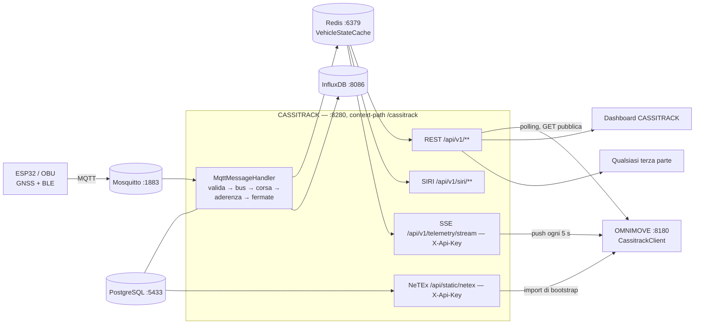

# Integrarsi con CASSITRACK

**Destinatari:** studenti che lavorano alla challenge CASSITRACK / OMNIMOVE.
**Obiettivo:** come un *consumatore esterno* ottiene i dati di flotta e dei bus da CASSITRACK, con
OMNIMOVE come implementazione di riferimento.

Tutto ciò che segue è ricavato dal codice in `cassitrack-backend/` e dal consumatore reale
`omnimove-backend/.../client/CassitrackClient.java`. Se un'API non è elencata qui, non esiste.

---

## 1. Panoramica

CASSITRACK è il **fornitore di dati** dell'ecosistema. I bus (unità ESP32 / OBU) pubblicano GPS e
telemetria grezzi via MQTT; CASSITRACK arricchisce lato server ogni fix (quale corsa, quale linea,
fermata precedente/successiva, ritardo, affollamento), mantiene lo stato live su Redis, scrive lo
storico su InfluxDB e ripubblica il risultato attraverso quattro superfici:

| Superficie | Formato | Consumatore tipico |
|---|---|---|
| REST `/api/v1/**` | JSON | app, dashboard, pianificazione viaggi OMNIMOVE |
| SIRI `/api/v1/siri/vehicle-monitoring` | XML (SIRI 2.0) | consumatori conformi agli standard |
| NeTEx `/api/static/netex` | XML (NeTEx) | import una tantum della rete statica |
| SSE `/api/v1/telemetry/stream` | `text/event-stream` con XML SIRI | sincronizzazione live di OMNIMOVE |

Principio fondamentale: **il bus riporta solo ciò che può misurare**. Corsa, linea, fermata corrente,
ritardo e affollamento sono *derivati da CASSITRACK*, mai presi per buoni dal payload: ricevi quindi
dati operativi già risolti e non devi ricalcolarli.



**Base URL locale:** `http://localhost:8280/cassitrack` (`server.port: 8280`,
`server.servlet.context-path: /cassitrack`). Dietro Nginx il prefisso è mantenuto:
`http://193.205.60.151:8280/cassitrack`.

---

## 2. Autenticazione

### 2.1 Cosa richiede davvero un token

La maggior parte di ciò che serve a un consumatore è **pubblica**. Da `SecurityConfig`:

* `permitAll()` sulle GET: `/api/v1/vehicles/**`, `/stops/**`, `/routes/**`, `/siri/**`,
  `/journeys/**`, `/telemetry/latest`, `/telemetry/stream`; e `/api/static/**` (ma il controller
  impone una API key).
* Tutto il resto è `authenticated()`. `/api/v1/buses/**` e `/api/v1/analytics/**` richiedono
  `FLEET_MANAGER`; `/api/v1/users/**` richiede `ADMIN`; `/api/v1/ai/**` accetta entrambi.

Esistono quindi **due credenziali distinte**: un **JWT** (endpoint di gestione/analytics, Swagger UI)
e una **API key** `X-Api-Key` (stream SSE, export NeTEx).

### 2.2 Ottenere e usare un JWT

`POST /api/v1/auth/login` (`AuthController`), body = `LoginRequest {email, password}`:

```bash
TOKEN=$(curl -s -X POST http://localhost:8280/cassitrack/api/v1/auth/login \
  -H 'Content-Type: application/json' \
  -d '{"email":"manager@cassitrack.it","password":"<la-tua-password>"}' | jq -r .token)

curl -s http://localhost:8280/cassitrack/api/v1/analytics/summary -H "Authorization: Bearer $TOKEN"
```

Body della risposta (`LoginResponse`):

```json
{ "token": "eyJhbGciOiJIUzI1NiJ9...", "username": "manager@cassitrack.it",
  "email": "manager@cassitrack.it", "role": "FLEET_MANAGER" }
```

Lo stesso token viene *anche* impostato come `Set-Cookie: cassitrack_jwt=<token>; Path=/;
Max-Age=3600; HttpOnly; SameSite=Strict`. Le pagine browser usano il cookie (JS non può leggerlo);
i client server-to-server usano il token nel body.

* **Algoritmo / durata:** HS256, `jwt.expiration-ms: 3600000` → **1 ora**. **Non esiste refresh
  token**: rifai il login alla scadenza.
* **Ruoli** (colonna testuale `users.role`): `ADMIN`, `FLEET_MANAGER`. Seminati in `V2`:
  `admin@cassitrack.it`, `manager@cassitrack.it`.
* **Brute force:** 5 tentativi falliti / 15 min → HTTP **429** + evento di audit `ACCOUNT_LOCKED`.
* `JwtAuthenticationFilter` legge **prima il cookie**, poi `Authorization: Bearer`.
* `POST /api/v1/auth/logout` mette il token in blacklist su Redis e restituisce **204**.

### 2.3 La API key

`SSE_API_TOKEN` (CASSITRACK) deve coincidere con `CASSITRACK_API_TOKEN` (consumatore). Confronto a
tempo costante (`MessageDigest.isEqual`). Chiave errata/assente → **401** su `/telemetry/stream`,
**403** su `/api/static/netex`.

---

## 3. Catalogo REST per i consumatori

Tutti i path sono relativi a `http://localhost:8280/cassitrack`.

### 3.1 Veicoli live — `VehicleController`

| Metodo | Path | Auth | Restituisce |
|---|---|---|---|
| GET | `/api/v1/vehicles` | pubblico | `VehicleStatusDTO[]` — veicoli attivi (GPS visto ≤ 300 s fa) |
| GET | `/api/v1/vehicles/{id}` | pubblico | un `VehicleStatusDTO`, **404** se sconosciuto/obsoleto |
| GET | `/api/v1/vehicles/count` | pubblico | `{"active":3,"total":4}` |
| GET | `/api/v1/vehicles/fleet-size` | pubblico | `{"total":4}` (righe in `buses`) |

```bash
curl -s http://localhost:8280/cassitrack/api/v1/vehicles | jq '.[0]'
```

```json
{
  "vehicle_id": "BUS1", "map_visible": true,
  "busId": 1, "numeroPosti": 50, "wheelchairAccessible": true,
  "lat": 41.4925, "lon": 13.8306, "speed_kmh": 27.4, "heading_deg": 142.0,
  "route_id": "LINEA_A_OUT", "route_name": "P.za San Benedetto → Università Folcara",
  "trip_id": "LINEA_A_OUT-0730",
  "schedule_status": "SLIGHTLY_LATE", "delay_minutes": 4,
  "delay_stop_name": "Staz. FF.SS.", "delay_stop_sequence": 5,
  "delay_measured_at": "2026-08-03T07:41:12Z",
  "last_stop_id": "SFF", "last_stop_name": "Staz. FF.SS.",
  "next_stop_id": "VBO", "next_stop_name": "Viale Bonomi", "eta_seconds": 180,
  "estimated_passengers": 21, "crowding_level": "MEDIUM", "occupancy_pct": 42,
  "timestamp": "2026-08-03T07:43:02Z", "last_seen": "2026-08-03T07:43:03Z",
  "is_active": true
}
```

Dettagli che fanno inciampare:

* `vehicle_id` è l'**identità radio** (`buses.current_vehicle_id`), non la targa. Dopo la migrazione
  `V11` le unità di bordo trasmettono `BUS1`, `BUS2`, `BUS2L`, `BUS3`; `MAGNI-00x` sono etichette di
  anagrafica.
* `schedule_status` ∈ `ON_TIME | SLIGHTLY_LATE | SIGNIFICANTLY_LATE | EARLY | UNKNOWN`.
* `crowding_level` ∈ `LOW | MEDIUM | HIGH | VERY_HIGH`, `null` se i passeggeri sono ignoti.
* `delay_minutes` ha segno: positivo = in ritardo, negativo = in anticipo.
* La nomenclatura è **mista**: quasi tutto snake_case, ma `busId`, `numeroPosti`,
  `wheelchairAccessible` sono camelCase (nessun `@JsonProperty`). Mappali esplicitamente.

### 3.2 Fermate e arrivi — `StopController`

| Metodo | Path | Auth | Restituisce |
|---|---|---|---|
| GET | `/api/v1/stops` | pubblico | tutte le fermate (record `Stop` grezzi) |
| GET | `/api/v1/stops/{stopId}/arrivals` | pubblico | `StopArrivalDTO[]` — previsioni **live** da GPS |
| GET | `/api/v1/stops/{stopId}/schedule` | pubblico | `StopArrivalDTO[]` — **orario** residuo di oggi |
| POST/PUT/DELETE | `/api/v1/stops[/{id}]` | FLEET_MANAGER | CRUD |

ID reali delle fermate (`V4`): `PSB` Piazza San Benedetto, `CRS` C.so Repubblica, `VLE` V.le Europa,
`VGA` Via Garigliano, `SFF` Staz. FF.SS., `VBO` Viale Bonomi, `UNI` Università Folcara,
`LIC` Liceo Scientifico, `OSP` Ospedale.

```bash
curl -s http://localhost:8280/cassitrack/api/v1/stops/UNI/arrivals | jq '.[0]'
```

```json
{
  "vehicle_id": "BUS1", "trip_id": "LINEA_A_OUT-0730",
  "route_id": "LINEA_A_OUT", "route_name": "P.za San Benedetto → Università Folcara",
  "route_short_name": "A", "crowding_level": "MEDIUM",
  "scheduled_arrival": "2026-08-03T07:45:00Z", "estimated_arrival": "2026-08-03T07:49:00Z",
  "delay_minutes": 4, "schedule_status": "SLIGHTLY_LATE", "delay_stop_name": "Staz. FF.SS."
}
```

`/schedule` restituisce la stessa forma ma con `vehicle_id: null`, `delay_minutes: 0` e
`schedule_status: "SCHEDULED"`: è l'orario statico, non una previsione. `stopId` è validato con
`^[A-Za-z0-9\-_]{1,50}$`; un id non valido produce **400**.

### 3.3 Linee e geometria — `RouteController`

`GET /api/v1/routes` (pubblica) restituisce le linee attive con le fermate ordinate **e** la
polilinea che segue le strade; `GET /api/v1/routes/manage` restituisce le righe `Route` grezze;
POST/PUT/DELETE richiedono FLEET_MANAGER.

```bash
curl -s http://localhost:8280/cassitrack/api/v1/routes | jq '.[0] | {id,name,longName,color,stops:.stops[0:2],path:.path[0:2]}'
```

```json
{
  "id": "LINEA_A_OUT", "name": "A",
  "longName": "P.za San Benedetto → Università Folcara", "color": "1976D2",
  "stops": [ { "id": "PSB", "name": "Piazza San Benedetto", "lat": 41.4925, "lon": 13.8306 },
             { "id": "CRS", "name": "C.so Repubblica", "lat": 41.4912, "lon": 13.8321 } ],
  "path":  [ { "lat": 41.4925, "lon": 13.8306 }, { "lat": 41.4921, "lon": 13.8312 } ]
}
```

`path` (da `route_shapes`) può essere un **array vuoto** per le linee senza geometria: in quel caso
disegna `stops`. Compaiono solo le linee con ≥ 2 fermate risolvibili.

### 3.4 SIRI — `SiriController`

```bash
curl -s 'http://localhost:8280/cassitrack/api/v1/siri/vehicle-monitoring?route_id=LINEA_A_OUT'
```

```xml
<Siri xmlns="http://www.siri.org.uk/siri" version="2.0"><ServiceDelivery>
  <ProducerRef>CASSITRACK</ProducerRef>
  <VehicleMonitoringDelivery version="2.0"><Status>true</Status>
    <VehicleActivity>
      <RecordedAtTime>2026-08-03T07:43:02.000Z</RecordedAtTime>
      <ValidUntilTime>2026-08-03T07:44:02.000Z</ValidUntilTime>
      <MonitoredVehicleJourney>
        <FramedVehicleJourneyRef><DataFrameRef>2026-08-03</DataFrameRef>
          <DatedVehicleJourneyRef>LINEA_A_OUT-0730</DatedVehicleJourneyRef></FramedVehicleJourneyRef>
        <VehicleLocation><Longitude>13.8306</Longitude><Latitude>41.4925</Latitude></VehicleLocation>
        <Bearing>142.0</Bearing><Occupancy>seatsAvailable</Occupancy><Delay>PT4M</Delay>
        <VehicleRef>BUS1</VehicleRef>
        <PreviousCalls><PreviousCall><StopPointRef>SFF</StopPointRef>
          <StopPointName>Staz. FF.SS.</StopPointName></PreviousCall></PreviousCalls>
        <MonitoredCall><StopPointRef>VBO</StopPointRef><StopPointName>Viale Bonomi</StopPointName>
          <VehicleAtStop>false</VehicleAtStop></MonitoredCall>
      </MonitoredVehicleJourney>
      <Extensions><Velocity>27.4</Velocity><NumberOfSeats>50</NumberOfSeats>
        <Passengers>21</Passengers><WheelchairAccess>true</WheelchairAccess></Extensions>
    </VehicleActivity>
  </VehicleMonitoringDelivery>
</ServiceDelivery></Siri>
```

`Delay` è una durata ISO-8601 (`PT0S`, `PT4M`, `-PT1M`). `Occupancy` usa il vocabolario SIRI
(`empty | manySeatsAvailable | seatsAvailable | fewSeatsAvailable | standingAvailable | full`).
Velocità, posti, passeggeri e accessibilità stanno nell'elemento non standard `<Extensions>`
**a livello di `VehicleActivity`**, non dentro `MonitoredVehicleJourney`.

### 3.5 NeTEx — `NetexController` (rete statica, API key)

```bash
curl -s -H "X-Api-Key: $SSE_API_TOKEN" \
  http://localhost:8280/cassitrack/api/static/netex -o netex.xml
```

Restituisce un `PublicationDelivery` completo (SiteFrame con gli `StopPlace`, ServiceFrame con le
linee, TimetableFrame con le corse, ResourceFrame con i veicoli, più le shape). Gli ID sono
namespaced `CASSITRACK:<Tipo>:<localId>`, es. `CASSITRACK:StopPlace:PSB`; gli orari sono `HH:mm:ss`.
Usalo **una volta all'avvio**, poi tieniti aggiornato con i canali live.

### 3.6 Telemetria (deprecata) ed endpoint con ruolo

* `GET /api/v1/telemetry/latest?route_id=LINEA_A_OUT` — pubblico, legge da InfluxDB,
  `BusTelemetryDTO[]` con campi **camelCase** (`busId, latitude, longitude, speed, bleDeviceCount,
  timestamp, delay, lastStopRegistered, tripId, passengers, capacity, nextStop`). Marcato
  **DEPRECATED** nel codice.
* `GET /api/v1/buses` (`?search=&status=&routeId=`), `/{id}`, `/route-options` — **FLEET_MANAGER**.
  Anagrafica statica (`BusDTO`: `busId, targa, numeroPosti, wheelchairAccessible, status, routeId,
  routeName, mapVisible, currentVehicleId`), *non* telemetria live.
* `GET /api/v1/analytics/{summary,adherence,busiest-hours,passengers-by-route,delay-by-route,co2,
  operating-hours,routes,routes-map}` — **FLEET_MANAGER**. Parametri di filtro validati con regex.
* `POST /api/v1/ai/chat` — FLEET_MANAGER o ADMIN.
* Swagger UI `/cassitrack/api/swagger-ui` e JSON OpenAPI `/cassitrack/api/docs` — **auth richiesta**.

---

## 4. Canale real-time

> **Leggi con attenzione.** Esistono la dipendenza `spring-boot-starter-websocket`, la proprietà
> `spring.websocket.stomp.endpoint: /ws/vehicles` e una regola `permitAll()` per `/ws/**` — ma
> **nel codice non c'è alcuna classe di configurazione `@EnableWebSocketMessageBroker`**. Nessun
> broker STOMP, nessun handler `/ws/vehicles`. Non progettare su quello. Il canale push reale è **SSE**.

### 4.1 Stream SSE — `GET /api/v1/telemetry/stream`

* `Content-Type: text/event-stream`, timeout dell'emitter `-1` (lato server non scade mai).
* Richiede `X-Api-Key: <SSE_API_TOKEN>`, altrimenti **401** con body vuoto.
* Capienza: **50 emitter concorrenti**; la 51ª connessione riceve **429**.
* Due tipi di frame: ogni **5 s** un `event: telemetry-update` il cui `data:` è un documento SIRI
  `<Siri>` completo costruito dalla cache Redis (stessa forma del §3.4, tutti i veicoli attivi);
  ogni **3 s** un commento SSE `:keepalive` che tiene aperta la connessione TCP.
* È un feed a **snapshot**, non a delta: ogni push contiene l'intera flotta attiva, quindi chi perde
  dei frame si risincronizza semplicemente al successivo.

```bash
curl -N -H "X-Api-Key: $SSE_API_TOKEN" http://localhost:8280/cassitrack/api/v1/telemetry/stream
```

```
:keepalive

event:telemetry-update
data:<Siri xmlns="http://www.siri.org.uk/siri" version="2.0"><ServiceDelivery>...</ServiceDelivery></Siri>
```

L'XML arriva come **unica riga `data:`**: gestiscilo come payload stringa, non come JSON. Se nessun
client è connesso lo scheduler non fa nulla (`if (emitters.isEmpty()) return;`).

### 4.2 Consigli sulla riconnessione

Il server non chiude mai lo stream deliberatamente, ma proxy, riavvii e problemi di rete lo faranno.
Fai come OMNIMOVE: sottoscrivi una volta all'avvio dell'applicazione e **riprova all'infinito con
delay fisso di 5 secondi**; tratta ogni riconnessione come una risincronizzazione pulita (non c'è
cursore né supporto a `Last-Event-ID` lato server); filtra sul nome evento `telemetry-update` e
ignora i commenti keepalive; e tieni un fallback — se lo stream è giù, fai polling su
`GET /api/v1/vehicles` (pubblico, senza chiave), come fanno le dashboard CASSITRACK ogni **15 s**
(`REFRESH = 15000`).

---

## 5. Caso di studio — OMNIMOVE

OMNIMOVE (porta **8180**, context-path `/omnimove`) consuma CASSITRACK attraverso **tre percorsi
indipendenti**. È il pattern che le terze parti dovrebbero copiare.

### 5.1 Configurazione

```yaml
# omnimove-backend/src/main/resources/application.yml
cassitrack:
  api:
    base-url: ${CASSITRACK_URL:http://localhost:8280/cassitrack/api/v1}
    token:    ${CASSITRACK_API_TOKEN}
  netex:
    url:      ${CASSITRACK_NETEX_URL:http://localhost:8280/cassitrack/api/static/netex}
```

La base URL include già `/api/v1`, quindi il codice client usa URI relativi brevi (`/vehicles`,
`/stops/{id}/arrivals`). `CASSITRACK_API_TOKEN` deve essere uguale a `SSE_API_TOKEN` di CASSITRACK.

### 5.2 Percorso pull — `CassitrackClient` (REST pubblica, senza auth)

Un unico `@Component` che incapsula un `WebClient` WebFlux e — come dice il suo javadoc — *l'unico
modo in cui OMNIMOVE accede ai dati di flotta: nessun database condiviso, nessun import da
cassitrack-backend*.

| Metodo | Chiama | Usato da |
|---|---|---|
| `getActiveVehicles()` | `GET /vehicles` → `VehicleDTO[]` | `JourneyPlannerService` (affollamento sulle tratte), `TrafficAwareETAService` (ETA su velocità reale), `AiOrchestrationService`, `JourneyController` |
| `getArrivalsAtStop(stopId)` | `GET /stops/{stopId}/arrivals` | tabelloni partenze live, tratte del viaggio |
| `getScheduleAtStop(stopId)` | `GET /stops/{stopId}/schedule` | fallback su orario quando non c'è nulla di live |
| `isAvailable()` | `GET /vehicles` come sonda di liveness | `JourneyPlannerService` imposta `realtimeAvailable` |

Ogni metodo è racchiuso in try/catch e **restituisce lista vuota in caso di errore**, loggando un
warning. È la decisione progettuale portante: se CASSITRACK è giù, OMNIMOVE continua a pianificare
viaggi, semplicemente senza dati live. Copia questo comportamento.

Il mapping è deliberatamente **stretto**: `it.unicas.omnimove.dto.VehicleDTO` dichiara solo sette
campi (`vehicle_id`, `lat`, `lon`, `speed_kmh`, `schedule_status`, `crowding_level`,
`estimated_passengers`) con i relativi `@JsonProperty`; tutto il resto che CASSITRACK invia viene
ignorato da Jackson. Consuma ciò che ti serve, non l'intero payload: così sei immune ai campi nuovi.

### 5.3 Percorso push — `TelemetrySyncService` (SSE + API key)

All'`ApplicationReadyEvent` apre lo stream SIRI e non lo molla più:

```java
webClient.get().uri("/telemetry/stream")
    .header("X-Api-Key", cassitrackApiToken)
    .retrieve()
    .bodyToFlux(new ParameterizedTypeReference<ServerSentEvent<String>>() {})
    .filter(event -> "telemetry-update".equals(event.event()))
    .retryWhen(Retry.fixedDelay(Long.MAX_VALUE, Duration.ofSeconds(5)))
    .subscribe(...);
```

Ogni frame viene deserializzato con `XmlMapper` nel DTO `Siri` di OMNIMOVE, convertito in
`BusTelemetryDTO` (`siriToDto`) e distribuito nei **propri** store: Redis (`bus:latest:{vehicleId}`)
e il proprio InfluxDB (`vehicle_position`). Il ritardo è decodificato da ISO-8601 (`PT2M` → 2);
l'accessibilità da `Extensions/WheelchairAccess` con fallback all'elemento legacy `<Accessibility>`;
il `trip_id` da `FramedVehicleJourneyRef/DatedVehicleJourneyRef`; la fermata successiva da
`MonitoredCall/StopPointName`; l'ultima fermata dal primo `PreviousCall`.

### 5.4 Percorso di bootstrap — `NetexImportService`

`GET {cassitrack.netex.url}` con `X-Api-Key`, deserializzato in `PublicationDeliveryDTO`, poi
riversato nel PostgreSQL di OMNIMOVE (fermate, linee, corse, fermate programmate, bus). È un import
**replace-all** che cancella prima i dati precedenti, e **aborta senza distruggere nulla se
CASSITRACK non restituisce dati** — lo stesso riflesso di degradazione controllata.

### 5.5 La lezione

| Dato | Canale | Cadenza | Auth |
|---|---|---|---|
| Rete statica (fermate, linee, orari) | REST NeTEx | bootstrap / su richiesta | `X-Api-Key` |
| Posizioni live | SSE SIRI | push, ogni 5 s | `X-Api-Key` |
| Dati live su interrogazione (arrivi, affollamento) | REST JSON | on demand | nessuna |

Non condividere mai un database con CASSITRACK. Il contratto HTTP è l'intera interfaccia.

---

## 6. Checklist di integrazione per un nuovo consumatore

1. **Ambiente** — definisci almeno `CASSITRACK_URL=http://localhost:8280/cassitrack/api/v1` e, per i
   canali push/NeTEx, `CASSITRACK_API_TOKEN=<stesso valore di SSE_API_TOKEN di CASSITRACK>`. Non
   scrivere mai l'host nel codice: cambia tra localhost e `193.205.60.151`.
2. **Credenziali** — chiedi al team CASSITRACK (a) la API key e (b) un account utente *solo* se ti
   servono endpoint FLEET_MANAGER/ADMIN. Le letture pubbliche non richiedono nulla.
3. **Client browser** — la tua origine va aggiunta a `CORS_ALLOWED_ORIGINS` lato CASSITRACK. Metodi
   ammessi GET/POST/PUT/DELETE/OPTIONS, header ammessi `Authorization, Content-Type, Accept,
   X-Api-Key`, `allowCredentials=false` — quindi il cookie JWT **non** viaggia cross-origin: usa
   l'header `Authorization`.
4. **Rate limit** — non esiste un rate limiter REST generale. I limiti reali sono **50 emitter SSE
   concorrenti** e **5 login falliti / 15 min per email**. Sii un buon cittadino: non fare polling su
   `/vehicles` più veloce delle dashboard (**15 s**); i dati cambiano solo all'arrivo dei messaggi MQTT.
5. **Gestione errori** — aspettati `200` con array vuoto (nulla di attivo, normale di notte), `400`
   (`stopId` non valido), `401` (`X-Api-Key` mancante/errata, o JWT scaduto), `403` (API key errata
   su NeTEx, o ruolo insufficiente), `404` (veicolo/fermata/linea sconosciuti), `409` (cancellazione
   bloccata da riferimenti), `429` (lockout login o capienza SSE), `5xx`/timeout (trattali come
   "niente dati live", mai come fatali). Incapsula ogni chiamata, ritorna vuoto di default e logga:
   è il pattern di `CassitrackClient`.
6. **Obsolescenza** — un veicolo sparisce da `/vehicles` dopo **300 s** senza fix GPS. Controlla
   comunque `last_seen` e `is_active` prima di mostrare una posizione, e rispetta `map_visible`
   (`false` = l'operatore ha nascosto quel bus dalle mappe pubbliche).
7. **Semantica** — non ricalcolare mai da solo ritardo, affollamento o fermata successiva: sono
   derivati lato server e sono l'unica fonte di verità. Ricalcolarli produrrà valori discordanti
   rispetto alle dashboard.
8. **Smoke test** — prima di scrivere codice:
   ```bash
   BASE=http://localhost:8280/cassitrack
   curl -s $BASE/api/v1/vehicles/count
   curl -s $BASE/api/v1/routes | jq 'length'
   curl -s $BASE/api/v1/stops/PSB/schedule | jq '.[0]'
   curl -sN -H "X-Api-Key: $SSE_API_TOKEN" $BASE/api/v1/telemetry/stream | head -20
   ```

---

## 7. Versionamento e contatti

* **Versione API:** `v1`, codificata nel path (`/api/v1/**`); l'export statico sta fuori, su
  `/api/static/netex`. Nessun header di versione, nessuna content negotiation sulla versione.
* **Versione applicativa:** `it.unicas:cassitrack:0.1.0-SNAPSHOT` — pre-release. Il contratto può
  ancora cambiare: tollera campi JSON sconosciuti (`@JsonIgnoreProperties(ignoreUnknown = true)`,
  oppure un DTO stretto ed esplicito come il `VehicleDTO` di OMNIMOVE).
* **Deprecazioni:** `GET /api/v1/telemetry/latest` è marcato deprecato nel sorgente. Non basarci
  nuovi consumatori.
* **Standard:** SIRI 2.0 (`http://www.siri.org.uk/siri`) per il real time, NeTEx per la rete statica.
  Entrambi sono prodotti da DTO scritti a mano, quindi sono profili *pragmatici* più che documenti
  pienamente validati a schema: valida prima di darli in pasto a uno strumento a valle rigoroso
  (`validate_siri.py` nella root del repo fa esattamente questo).
* **Evoluzione dello schema:** il database è gestito da Flyway (attualmente fino a `V14`), le
  migrazioni sono append-only, e ogni modifica a linee/fermate/bus diventa visibile tramite un nuovo
  export NeTEx.
* **Implementazione di riferimento viva:** `omnimove-backend` — leggi `CassitrackClient`,
  `TelemetrySyncService` e `NetexImportService` prima di chiedere: la risposta è quasi sempre lì.
* **Contatti:** team backend CASSITRACK, Università degli Studi di Cassino e del Lazio Meridionale,
  a.a. 2025–2026. Riferimento API interattivo:
  `http://localhost:8280/cassitrack/api/swagger-ui` (richiede login).
