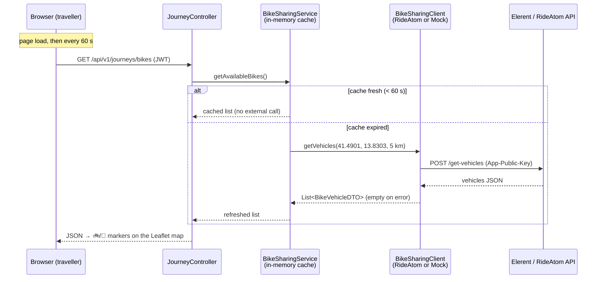

# Elerent (bike sharing) integration in OMNIMOVE

> Italian version: [elerent_it.md](elerent_it.md)

Elerent operates the bike/scooter sharing service in Cassino on the
**ATOM Mobility** platform ("RideAtom" API: <https://app.rideatom.com/api/docs>,
*Sharing* tag).

OMNIMOVE shows the available Elerent vehicles and the operating zones on the
traveller map, **read-only**: no unlocking, no payments, no writes towards
Elerent. The integration lives entirely in `omnimove-backend` — CASSITRACK is
not involved (bikes are not a monitored fleet, they are availability data).

Since we currently **do not have an App-Public-Key**, the system ships with a
**simulated** (mock) provider that generates a realistic fleet over Cassino.
Switching to the real service requires no code changes: configuration only.

## Who is who: Elerent, ATOM Mobility, RideAtom

The three names appearing in this document play different roles:

- **Elerent** is the *operator*: it physically owns the bikes and scooters in
  Cassino and runs the customer-facing service (app, fares, support).
- **ATOM Mobility** is the *technology provider*: a company (headquartered in
  Riga, Latvia) offering a white-label software platform for bike, scooter,
  moped and car sharing services. An operator like Elerent does not build its
  own app, backend, fleet management and payments from scratch: it "rents" them
  from ATOM, which supplies the operator-branded app, the fleet dashboard and
  the APIs.
- **RideAtom** (`app.rideatom.com`) is the domain of ATOM's API infrastructure.
  The APIs documented at <https://app.rideatom.com/api/docs> are therefore not
  strictly "Elerent's APIs" but the ATOM platform APIs, identical for every
  operator running on it. That is exactly what the **App-Public-Key** is for:
  it identifies *which* operator's installation you are querying — in our case,
  Elerent's.

This structure explains two choices you will find further down: the
`RideAtomClient` parses fields *defensively*, because responses may vary
slightly across platform installations and versions (§1); and it is worth
asking whether the installation exposes a **GBFS feed**, since many ATOM
deployments offer one out of the box (§4.1).

---

## 1. How to enable the real integration

### Step 1 — Obtain the key

Request the installation's **App-Public-Key** from Elerent (or ATOM Mobility).
Every *Sharing* endpoint requires it in the `App-Public-Key` header. For the two
endpoints we use, the public key alone is enough: **no user token needed**.

> Tip: also ask whether the installation exposes a **GBFS feed** (an open
> standard many ATOM deployments support). If it does, the right move is a third
> `GbfsClient` implementation of the same interface — see §4.

### Step 2 — Set the environment variables

```bash
ELERENT_API_MOCK=false
ELERENT_PUBLIC_KEY=<key provided by Elerent>
# optional:
ELERENT_API_URL=https://app.rideatom.com/openapi/v1.0/sharing   # default
```

The matching configuration lives in
`omnimove-backend/src/main/resources/application.yml`, block `elerent.api`
(base-url, public-key, mock, radius-km).

### Step 3 — Restart omnimove-backend

At startup the log tells you which provider is active:

- `MockElerentClient active — N simulated vehicles in Cassino …` → mock
- `RideAtomClient → https://… (key configured)` → real API

Nothing else is needed: frontend, REST endpoints and service are identical in
both cases.

### RideAtom endpoints used (read-only)

| Endpoint | Auth | Purpose |
|---|---|---|
| `POST /get-vehicles` — body `{user_latitude, user_longitude, radius_in_km}` | Public key only | Vehicle positions: id, plate (`nr`), battery, type, coordinates |
| `POST /get-zones` | Public key only | Operating / no-parking zones: polygon or circle, colour, title |

We deliberately **exclude** `start-ride`, `end-ride`, `pause`,
`send-vehicle-commands`, `purchase`: those are write operations, require a user
token, and belong to a future phase (deep-link handoff to the Elerent app).

---

## 2. Data flow from Elerent to OMNIMOVE



Components (all in `omnimove-backend`):

| Component | File | Role |
|---|---|---|
| Client (interface) | `client/BikeSharingClient.java` | Read-only contract: `getVehicles()`, `getZones()` |
| Real client | `client/RideAtomClient.java` | Calls RideAtom; lenient parsing; on error → empty list |
| Mock client | `client/MockElerentClient.java` | Deterministic simulated fleet (fixed seed) on real Cassino landmarks |
| Service | `service/BikeSharingService.java` | TTL cache: 60 s vehicles, 10 min zones |
| REST | `controller/JourneyController.java` | `GET /api/v1/journeys/bikes`, `GET /api/v1/journeys/bikes/zones` |
| DTOs | `dto/BikeVehicleDTO.java`, `dto/BikeZoneDTO.java` | snake_case format towards the browser |
| Frontend | `static/omnimove-traveller.js` | Markers, zones, 60 s polling, filtering via the mode chips |

The endpoints are protected like every `/api/v1/journeys/**` route: an
authenticated user is required (TRAVELLER or ADMIN, JWT in the `Authorization`
header).

---

## 3. The approach: when are requests sent? Is data stored locally?

### When OMNIMOVE contacts the Elerent server (real or simulated)

The browser **never talks to Elerent directly**: it only calls the OMNIMOVE
backend. Calls towards Elerent originate exclusively from `BikeSharingService`,
which decides *when*:

1. The frontend queries `GET /journeys/bikes` on page load and then **every 60
   seconds** (polling), plus a one-off fetch of the zones.
2. The service answers **from its cache** whenever the data is younger than 60
   seconds (10 minutes for zones, which rarely change).
3. Only when the cache has expired does **one** `POST /get-vehicles` call go out
   to Elerent.

Consequence: **at most ~1 request per minute towards Elerent, regardless of how
many users are connected**. A hundred polling browsers still produce the same
single upstream call. This protects the provider's API (and any rate limits) and
keeps the cost of the integration constant.

With the mock enabled, the "Elerent server" is a local class: the flow and the
timing are identical, `getVehicles()` simply returns the simulated fleet without
touching the network. That is why the demo behaves exactly like the real version
will.

### Persistence: is the data stored locally?

**No.** Elerent data is deliberately **ephemeral**:

- it lives only in the process's **in-memory cache** (`BikeSharingService`: two
  fields plus a timestamp, the same pattern as `WeatherService`);
- it is **not** written to PostgreSQL, Redis or InfluxDB;
- on every backend restart the cache starts empty and is repopulated on the
  first request;
- on any failure (missing key, unreachable API, timeout) the client logs a
  warning and returns an empty list: the map keeps working and the bike layer
  simply disappears. No exception ever reaches the browser.

This is a deliberate choice: the position of a free-floating bike is throwaway
data that goes stale in seconds; persisting it would add no value to the journey
planner and would only accumulate stale rows. If historical analysis is ever
needed (e.g. average availability per zone), the right place to add the write is
`BikeSharingService`, towards InfluxDB, without touching the client or the
controller.

---

## 4. Planned evolutions (out of the current scope)

### 4.1 GBFS as an alternative (or additional) data source

**What it is.** GBFS (*General Bikeshare Feed Specification*) is the open
standard for publishing shared-mobility availability data. It is a set of plain
JSON files served over HTTP — the relevant ones for us are
`free_bike_status.json` (position, battery and availability of each
free-floating vehicle), `station_information.json` / `station_status.json`
(docks, if any) and `geofencing_zones.json` (operating and no-ride zones as
GeoJSON). Feeds are public by design: **no API key, no authentication**, and the
spec even declares the polling frequency via a `ttl` field.

**Why it matters here.** Many ATOM Mobility installations expose a GBFS feed in
addition to the proprietary RideAtom API. If Elerent's does, GBFS becomes the
preferable source for our read-only use case: it is exactly the data we need,
with no key to obtain and no dependency on RideAtom's undocumented response
shapes (our `RideAtomClient` has to parse defensively precisely because field
names vary across deployments).

**How to implement it.** This is the scenario the current design was built for:

1. add `client/GbfsClient.java` implementing `BikeSharingClient` — two GET
   calls (`free_bike_status.json`, `geofencing_zones.json`), each mapped to the
   existing `BikeVehicleDTO` / `BikeZoneDTO`;
2. add an `elerent.api.provider` property (`mock` | `rideatom` | `gbfs`) and use
   it in the `@ConditionalOnProperty` annotations to pick the implementation
   (today the switch is the boolean `elerent.api.mock`; a three-way enum is the
   natural generalisation);
3. nothing else changes: `BikeSharingService` (and its cache),
   `JourneyController`, the DTOs and the whole frontend are provider-agnostic.

The roadmap (`email_team_roadmap.md`) already points to a working GBFS example
based on Dott Rome, which can serve both as a reference feed during development
and as a compatibility test for the client.

### 4.2 Real availability in journey planning — ✅ implemented

`planBike()` and `planScooter()` are now grounded in the real (or mock) fleet
through a shared `planSharedVehicle()` helper in `JourneyPlannerService`:

- **Nearest-vehicle leg**: `BikeSharingService.findNearest()` picks the closest
  available vehicle of the right type; a WALK leg (origin → vehicle, with map
  coordinates) is prepended before the ride leg, so total duration includes the
  walk and the comparison with BUS/WALK is honest. If the vehicle is < 40 m
  away the walk leg is omitted.
- **Honest availability**: if no vehicle is within the traveller's maximum
  walking distance, the option is dropped and a notice explains why. The
  maximum distance is a **user preference** (`max_bike_walk_metres`, default
  **500 m**, migration V16) editable in the Preferences panel (250 m–1 km).
  With *prefer bike over bus* enabled, `plan()`'s existing fallback re-plans
  the bus automatically.
- **Battery is informative, never a filter**: a low-battery vehicle is still
  proposed, with battery bars rendered by the frontend — green 3 bars ≥ 60 %
  (charged), yellow 2 bars 25–59 % (critical), red 1 bar 10–24 % / 0 bars
  < 10 % (empty). The same badge appears in the map popups and in the journey
  timeline (`bike_battery_pct` on the option).
- **Zone-aware destination check**: `checkDestinationZones()` (ray-casting
  point-in-polygon plus circle zones, `util/GeoUtils`) sets `bike_warning` on
  the option when the destination is outside the operating area or inside a
  no-parking zone; the card shows it as a warning badge.

All of this consumes the same cached data the map already uses, so it adds **no
extra calls** towards Elerent. The option also carries `bike_id`, `bike_plate`
and `bike_walk_metres`, shown in the card summary and timeline.

### 4.3 Unlocking and payments: deep-link handoff only

**The boundary.** Everything in this document is read-only on purpose. Actually
*renting* a vehicle (`start-ride`, `end-ride`, `pause`, `purchase`…) is a
different class of problem: those endpoints act on behalf of a specific rider,
require a per-user `Authorization` token issued by the Elerent/ATOM account
system, and move real money with real-world side effects (a bike physically
unlocks).

**Level 1 — deep-link handoff (the planned step).** When the traveller taps a
bike, OMNIMOVE opens the Elerent app (or its store page / web fallback) via a
deep link, ideally pre-selecting the chosen vehicle. Identity, payment,
unlocking and liability all stay with Elerent, where they already work. This
matches level 1 of the payments roadmap (`payments_integration_*.md`, referenced
by the team roadmap) and costs little: one URL scheme in the popup, no backend
work.

**Why OMNIMOVE must never unlock with just the public key.** The
`App-Public-Key` identifies the *application*, not a *user*. Attempting to drive
rides through it (e.g. via the `user_id` + secret-key variant of the API) would
mean OMNIMOVE holding Elerent's secret credentials and acting as a payment
intermediary: it would take on PCI/liability duties, customer support for stuck
rides, and refund flows — none of which belong in a journey planner. Deeper
integration (in-app unlock, level 2+) should only ever be built on a proper
per-user OAuth-style flow agreed with Elerent, in which the rider authenticates
against Elerent and OMNIMOVE never touches their credentials or payment
instruments.
