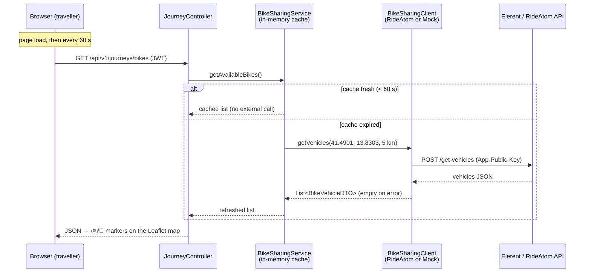

# Elerent (bike sharing) integration in OMNIMOVE

> Italian version: [elerent_it.md](elerent_it.md)

Elerent operates the bike/scooter sharing service in Cassino on the
**ATOM Mobility** platform ("RideAtom" API: <https://app.rideatom.com/api/docs>,
*Sharing* tag).

OMNIMOVE shows the available Elerent vehicles and the operating zones on the
traveller map, **read-only**: no unlocking, no payments, no writes towards
Elerent. The integration lives entirely in `omnimove-backend` — CASSITRACK is
not involved (bikes are not a monitored fleet, they are availability data).

The integration now runs entirely on real data: the **zones** come from the
public Sharing API with Elerent's App-Public-Key, and the **vehicle positions**
from Elerent's operator dashboard, because the consumer API serves vehicles only
on behalf of a signed-in rider and Elerent has no rider id to lend (§1.1).
Nothing is simulated in their place: when Elerent cannot be reached the bike
layer empties and the map says why (§1.5).

## Who is who: Elerent, ATOM Mobility, RideAtom

The three names appearing in this document play different roles:

- **Elerent** is the *operator*: it physically owns the bikes and scooters in
  Cassino and runs the customer-facing service (app, fares, support).
- **ATOM Mobility** is the *technology provider*: a company (headquartered in
  Riga, Latvia) offering a white-label software platform for bike, scooter,
  moped and car sharing services. An operator like Elerent does not build its
  own app, backend, fleet management and payments from scratch: it "rents" them
  from ATOM, which supplies the operator-branded app, the fleet dashboard and
  the APIs.
- **RideAtom** (`app.rideatom.com`) is the domain of ATOM's API infrastructure.
  The APIs documented at <https://app.rideatom.com/api/docs> are therefore not
  strictly "Elerent's APIs" but the ATOM platform APIs, identical for every
  operator running on it. That is exactly what the **App-Public-Key** is for:
  it identifies *which* operator's installation you are querying — in our case,
  Elerent's.

This structure explains two choices you will find further down: the
`RideAtomClient` parses fields *defensively*, because responses may vary
slightly across platform installations and versions (§1); and it is worth
asking whether the installation exposes a **GBFS feed**, since many ATOM
deployments offer one out of the box (§4.1).

---

## 1. Enabling the real integration

### Step 1 — The key

Elerent's **App-Public-Key** goes in the `App-Public-Key` header of every
*Sharing* endpoint; it is what selects Elerent's installation out of the shared
ATOM platform. The key is in `omnimove-backend/.env` (gitignored), not in the
repository.

The key is genuinely Elerent's and not a demo account: calling `/get-zones`
**without** any key returns ATOM's own showcase zones (Riga, Bordeaux), with an
invalid key returns `{"message": "No access"}`, and with ours returns 671 zones
across every Elerent city — 29 of them in Cassino.

### Step 2 — Set the environment variables

```bash
ELERENT_API_MOCK=false
ELERENT_PUBLIC_KEY=<key provided by Elerent>
# optional:
ELERENT_DASHBOARD_EMAIL=<dashboard account>                     # see §1.1
ELERENT_DASHBOARD_PASSWORD=<dashboard password>                 # see §1.1
ELERENT_SECRET_KEY=<secret key>                                 # see §1.1
ELERENT_API_URL=https://app.rideatom.com/openapi/v1.0/sharing   # default
```

The matching configuration lives in
`omnimove-backend/src/main/resources/application.yml`, block `elerent.api`
(base-url, public-key, secret-key, dashboard-url, dashboard-email,
dashboard-password, mock, centre-lat, centre-lon, radius-km).

### Step 3 — Restart omnimove-backend

At startup the log tells you which provider is active:

- `MockElerentClient ready — N simulated vehicles in Cassino …` → the mock is
  loaded (as the provider when `mock=true`, as the vehicle fallback otherwise)
- `RideAtomClient → https://… (public key configured, secret key configured,
  user id absent, vehicle fallback on)` → real API

Nothing else is needed: frontend, REST endpoints and service are identical in
both cases.

### 1.1 Credentials: what opens what

Three credentials ended up in play, because the consumer API turned out not to
serve what a map needs:

| Credential | Opens | Used for |
|---|---|---|
| **App-Public-Key** | `POST /openapi/v1.0/sharing/get-zones` | the zones — §1.2 |
| **Secret key** (account 264) | authenticates `get-vehicles`, but the call then demands a `user_id` | nothing: kept only in case Elerent ever issues a rider id |
| **Dashboard account** (operator role) | `POST /api/v2/admin/login/openapi` → `POST /api/v2/admin/vehicles` | the vehicle positions — §1.4 |

The dead end is worth recording, because it is not obvious from the
documentation page. `get-vehicles` is designed to answer *"what does this rider
see when they open the app"*, so with the secret key it replies:

```
400 {"message": "Validation failed", "errors": [{"error_info":
     "Value error, user_id is required when using secret key authentication"}]}
```

Secret-key authentication acts **on behalf of a rider**, and the account id 264
carried inside the key is not one (`User not found.`). Elerent has no rider id
to lend, so that route is closed and the secret key is kept only in case
they ever issue one.

Their answer was to give us a **dashboard account** instead, which is what the
vehicles now come from. It is a privileged credential and the integration treats
it as one:

> The dashboard token also reaches fleet operations — changing a vehicle's
> status, ending a ride, creating tasks. The role granted to us is *operator*,
> which does not cover customer records or identity-document review, but the
> capability that remains is real. `ElerentDashboardClient` calls exactly two
> endpoints, the login and the vehicle list, and nothing else in the codebase
> holds the token. The credentials live only in `omnimove-backend/.env`
> (gitignored) and must never reach the frontend or the repository. Worth
> recording in the DPIA: *OMNIMOVE holds operator-role credentials at Elerent,
> used read-only on two endpoints, technically capable of fleet operations.*

A **GBFS feed** (§4.1) would still be the better answer for everyone: it needs no
credentials at all, so we could hand back both the secret key and the dashboard
account.

### 1.4 Vehicle positions: the dashboard route

`POST /api/v2/admin/vehicles` with `filter: ["ACTIVE"]` returns the vehicles
ready for hire — 28 across the whole account at the time of writing, all of them
in Cassino. `RideAtomClient` delegates `getVehicles()` to
`ElerentDashboardClient` whenever the dashboard credentials are set, and keeps
serving the zones itself.

Two calls per refresh, joined on the vehicle id, because neither alone is
enough: the **paginated list** carries `vehicle_number`, the exact
`vehicle_battery` and `coordinates`, while the **map view** (`map_view: true`)
carries `icon`, the only field in this API that distinguishes a bike from a
scooter.

Icons are opaque numbers, so the mapping is derived rather than hardcoded: the
fleet's vehicle models are read from `select_options.vehicle_models`, a model is
a bike when its name says so (`OMNI Dyna bike CAS`) and a scooter otherwise
(`Segway MAX CAS`, `Hongji CAS`), and one query per model reveals which icon it
uses. The result — today `{645: BIKE, 648: SCOOTER}` — is cached for six hours,
so a model added next month classifies itself instead of showing up under the
wrong icon.

The dashboard token lasts **72 hours** and is kept until shortly before it
expires: one login every three days, not one per minute. A 401 clears it and the
call is retried once.

### 1.5 When there are no vehicles to show

Nothing is ever drawn in place of real data. `MockElerentClient` exists only for
local development (`elerent.api.mock=true`); it is not a fallback, because a
simulated bike sends a traveller to an empty pavement.

So an empty bike layer has two causes, and the traveller is told which:

| Situation | `GET /journeys/bikes` | What the map shows |
|---|---|---|
| Elerent unreachable | **503**, empty list | "Elerent is not responding: shared bikes and scooters cannot be shown right now" |
| Elerent says nothing is free | **200**, empty list | "No Elerent bike or scooter available in Cassino at the moment" |

The notice sits on the map and is **dismissed only by the reader**, with its ✕.
The layer polls every 60 s, so a notice that reinstated itself would be more
irritating than the problem it reports: once closed it stays closed for that
page session.

Positions, unlike zones, are **not** kept across a failed refresh. A bike that
has since been ridden away is a wasted walk, so a stale position is worse than
no position — the opposite trade-off from the zones, which are kept precisely
because they change so rarely.

### 1.2 What comes back for Cassino

`/get-zones` answers with a **bare JSON array** of every zone of every Elerent
city (~670, 660 KB). The client keeps the ones within `radius-km` of
`centre-lat/centre-lon` — 29 for Cassino — so the browser is not handed a
nationwide polygon set on every load:

| Type | Count | What it is |
|---|---|---|
| `PARKING_ZONE` | 17 | 16 parking bays 10–200 m across, plus one 2.2 km polygon covering the town centre, the station and the hospital |
| `NO_PARKING_ZONE` | 7 | 100–590 m, all in the centre |
| `NO_GO_ZONE` | 2 | one 1.1 km, one 13.7 km polygon that includes the Folcara campus |
| `SPEED_LIMIT_ZONE` | 3 | "6 km/h", around the pedestrian core |

Every zone also carries `zone_vehicle_types`, the vehicle types it binds
(`BIKE`, `E_BIKE`, `SCOOTER`…). It travels to the browser as `vehicle_types`,
appears in the zone popup, and filters the drop-off check: a scooters-only
no-parking zone no longer relocates the end of a bike ride. In Cassino 26 zones
cover bikes and scooters alike, and the 3 "6 km/h" zones apply to `SCOOTER` and
`E_BIKE` only.

Two details of the payload the earlier code did not survive: `zone_area` is a
**GeoJSON polygon**, so its coordinates are `[longitude, latitude]` nested one
level per ring — the opposite order and shape of the `[lat, lon]` pairs
`GeoUtils` and Leaflet expect — and `zone_color` is bare hex (`21C378`) with no
`#`. Circular zones (`park_place_zone`, none in Cassino) leave `zone_area` null
and carry `zone_point` + `zone_radius` instead.

### 1.3 Mandatory parking, and what it does to a plan

Elerent confirmed the rule the geometry suggested: **a ride may only end inside
a parking zone**. `BikeSharingService` therefore treats `PARKING_ZONE`,
`PAID_PARKING_ZONE` and `PARK_PLACE_ZONE` as the operating area — the platform
has no separate "service area" type — and `NO_PARKING_ZONE` / `NO_GO_ZONE` as
forbidden. The forbidden test runs first, so a `NO_PARKING_ZONE` cannot match on
the substring "PARK" and be mistaken for somewhere to park.

Turning the rule on exposed a gap in the drop-off search. `no_go_zone` 4411 is
the "everything outside the service area" polygon — it covers **73% of the area
within 2 km of the centre**, with a hole over the town. Stepping just outside it,
which is what the code did for a forbidden zone, lands on the boundary of the
service area: legal to ride through, not somewhere the vehicle may be left. Both
constraints have to be solved together, so `findLegalDropOff()` now looks for the
nearest point that is inside a parking zone **and** outside every zone forbidden
to that vehicle, verifying each candidate through `checkDestinationZones()`
before accepting it. Each zone offers two candidates — just inside its nearest
edge, and its middle — because the bays are 10–200 m across and an edge point can
be unusable while the middle is fine.

A destination can fail in three different ways, and the traveller is told which,
because they are not the same news: inside a **no-parking zone** (a local rule —
26 of the 1249 test points), inside a **no-go zone** (Elerent does not operate
there at all — 957 points, nearly all of them the mountainside and the outskirts
covered by zone 4411), or simply **outside every parking zone** (149 points).
Reporting the second as the first used to explain the wrong thing: "you cannot
park here" when the honest answer was "the service does not reach here".

Measured over 1249 destinations spread within 2 km of the centre, every drop-off
produced is legal (it was 971 out of 1132 illegal before the drop-off search was
rewritten). How often
a traveller sees the notice depends on where they are going:

| Distance from the centre | Destinations where the ride can end as-is |
|---|---|
| within 500 m | 71% |
| within 1 km | 38% |
| within 2 km | 10% |

So in the core most rides are unaffected, while a peripheral destination ends at
a parking bay with the last stretch on foot (average 540 m over the whole 2 km
disc). The Folcara campus is the notable case: it sits inside no-go zone 4411,
so a bike ride there ends ~440 m away.

### Endpoints deliberately not used

`start-ride`, `end-ride`, `pause`, `send-vehicle-commands`, `purchase`: write
operations that unlock vehicles and move money. The secret key would now open
them, which is exactly why it is never sent anywhere but `/get-vehicles` —
renting belongs to Elerent's own app (deep-link handoff, §4.3).

---

## 2. Data flow from Elerent to OMNIMOVE


```mermaid
sequenceDiagram
    participant B as Browser (traveller)
    participant C as JourneyController
    participant S as BikeSharingService<br/>(in-memory cache)
    participant K as BikeSharingClient<br/>(RideAtom or Mock)
    participant E as Elerent / RideAtom API

    Note over B: page load, then every 60 s
    B->>C: GET /api/v1/journeys/bikes (JWT)
    C->>S: getAvailableBikes()
    alt cache fresh (< 60 s)
        S-->>C: cached list (no external call)
    else cache expired
        S->>K: getVehicles(41.4901, 13.8303, 5 km)
        K->>E: POST /get-vehicles (App-Public-Key)
        E-->>K: vehicles JSON
        K-->>S: List<BikeVehicleDTO>  (empty on error)
        S-->>C: refreshed list
    end
    C-->>B: JSON → 🚲/🛴 markers on the Leaflet map
```

Components (all in `omnimove-backend`):

| Component | File | Role |
|---|---|---|
| Client (interface) | `client/BikeSharingClient.java` | Read-only contract: `getVehicles()`, `getZones()` |
| Zones client | `client/RideAtomClient.java` | Calls RideAtom for the zones; lenient parsing, GeoJSON → `[lat, lon]`, filtered to the service area; delegates vehicles to the dashboard client |
| Vehicles client | `client/ElerentDashboardClient.java` | Operator dashboard: login + vehicle list, types resolved by model, token kept for 72 h |
| Mock client | `client/MockElerentClient.java` | Deterministic simulated fleet (fixed seed) on real Cassino landmarks |
| Service | `service/BikeSharingService.java` | TTL cache: 60 s vehicles, 10 min zones |
| REST | `controller/JourneyController.java` | `GET /api/v1/journeys/bikes`, `GET /api/v1/journeys/bikes/zones` |
| DTOs | `dto/BikeVehicleDTO.java`, `dto/BikeZoneDTO.java` | snake_case format towards the browser; zones carry the vehicle types they bind |
| Frontend | `static/omnimove-traveller.js` | Markers, zones, 60 s polling, filtering via the mode chips |

The endpoints are protected like every `/api/v1/journeys/**` route: an
authenticated user is required (TRAVELLER or ADMIN, JWT in the `Authorization`
header).

---

## 3. The approach: when are requests sent? Is data stored locally?

### When OMNIMOVE contacts the Elerent server (real or simulated)

The browser **never talks to Elerent directly**: it only calls the OMNIMOVE
backend. Calls towards Elerent originate exclusively from `BikeSharingService`,
which decides *when*:

1. The frontend queries `GET /journeys/bikes` on page load and then **every 60
   seconds** (polling), plus a one-off fetch of the zones.
2. The service answers **from its cache** whenever the data is younger than 60
   seconds (10 minutes for zones, which rarely change).
3. Only when the cache has expired does **one** `POST /get-vehicles` call go out
   to Elerent.

Consequence: **at most ~1 request per minute towards Elerent, regardless of how
many users are connected**. A hundred polling browsers still produce the same
single upstream call. This protects the provider's API (and any rate limits) and
keeps the cost of the integration constant.

With the mock enabled, the "Elerent server" is a local class: the flow and the
timing are identical, `getVehicles()` simply returns the simulated fleet without
touching the network. That is why the demo behaves exactly like the real version
will.

### Persistence: is the data stored locally?

**No.** Elerent data is deliberately **ephemeral**:

- it lives only in the process's **in-memory cache** (`BikeSharingService`: two
  fields plus a timestamp, the same pattern as `WeatherService`);
- it is **not** written to PostgreSQL, Redis or InfluxDB;
- on every backend restart the cache starts empty and is repopulated on the
  first request;
- on any failure (missing key, unreachable API, timeout) the client logs a
  warning and returns an empty list: the map keeps working and the bike layer
  simply disappears. No exception ever reaches the browser.

This is a deliberate choice: the position of a free-floating bike is throwaway
data that goes stale in seconds; persisting it would add no value to the journey
planner and would only accumulate stale rows. If historical analysis is ever
needed (e.g. average availability per zone), the right place to add the write is
`BikeSharingService`, towards InfluxDB, without touching the client or the
controller.

---

## 4. Planned evolutions (out of the current scope)

### 4.1 GBFS as an alternative (or additional) data source

**What it is.** GBFS (*General Bikeshare Feed Specification*) is the open
standard for publishing shared-mobility availability data. It is a set of plain
JSON files served over HTTP — the relevant ones for us are
`free_bike_status.json` (position, battery and availability of each
free-floating vehicle), `station_information.json` / `station_status.json`
(docks, if any) and `geofencing_zones.json` (operating and no-ride zones as
GeoJSON). Feeds are public by design: **no API key, no authentication**, and the
spec even declares the polling frequency via a `ttl` field.

**Why it matters here.** Many ATOM Mobility installations expose a GBFS feed in
addition to the proprietary RideAtom API, and GBFS carries vehicle positions
without any credential — exactly the data `/get-vehicles` refuses us (§1.1).

**Where it would live.** ATOM publishes each operator's feed on the operator's
own subdomain, in the form
`https://<operator>.rideatom.com/gbfs/<system-id>/v3.0/gbfs` (the pattern used
by Yoio, Yaldi, 3electra and others registered in MobilityData's `systems.csv`).
`elerent.rideatom.com` exists and answers on `/gbfs`, but with `Incorrect data.`
for every system id from 1 to 1000, and Elerent is not in the MobilityData
catalogue — so either the feed is not enabled for this account, or it is
published under an id we cannot guess. **This is worth one email to Elerent or
ATOM**: it would remove both the missing-token problem and the API key.

**How to implement it.** This is the scenario the current design was built for:

1. add `client/GbfsClient.java` implementing `BikeSharingClient` — two GET
   calls (`free_bike_status.json`, `geofencing_zones.json`), each mapped to the
   existing `BikeVehicleDTO` / `BikeZoneDTO`;
2. add an `elerent.api.provider` property (`mock` | `rideatom` | `gbfs`) and use
   it in the `@ConditionalOnProperty` annotations to pick the implementation
   (today the switch is the boolean `elerent.api.mock`; a three-way enum is the
   natural generalisation);
3. nothing else changes: `BikeSharingService` (and its cache),
   `JourneyController`, the DTOs and the whole frontend are provider-agnostic.

The roadmap (`email_team_roadmap.md`) already points to a working GBFS example
based on Dott Rome, which can serve both as a reference feed during development
and as a compatibility test for the client.

### 4.2 Real availability in journey planning — ✅ implemented

`planBike()` and `planScooter()` are now grounded in the real (or mock) fleet
through a shared `planSharedVehicle()` helper in `JourneyPlannerService`:

- **Nearest-vehicle leg**: `BikeSharingService.findNearest()` picks the closest
  available vehicle of the right type; a WALK leg (origin → vehicle, with map
  coordinates) is prepended before the ride leg, so total duration includes the
  walk and the comparison with BUS/WALK is honest. If the vehicle is < 40 m
  away the walk leg is omitted.
- **Honest availability**: if no vehicle is within the traveller's maximum
  walking distance, the option is dropped and a notice explains why. The
  maximum distance is a **user preference** (`max_bike_walk_metres`, default
  **500 m**, migration V16) editable in the Preferences panel (250 m–1 km).
  With *prefer bike over bus* enabled, `plan()`'s existing fallback re-plans
  the bus automatically.
- **Battery is informative, never a filter**: a low-battery vehicle is still
  proposed, with battery bars rendered by the frontend — green 3 bars ≥ 60 %
  (charged), yellow 2 bars 25–59 % (critical), red 1 bar 10–24 % / 0 bars
  < 10 % (empty). The same badge appears in the map popups and in the journey
  timeline (`bike_battery_pct` on the option).
- **Zone-aware destination check**: `checkDestinationZones()` (ray-casting
  point-in-polygon plus circle zones, `util/GeoUtils`) sets `bike_warning` on
  the option when the destination is outside the operating area or inside a
  no-parking zone; the card shows it as a warning badge.

All of this consumes the same cached data the map already uses, so it adds **no
extra calls** towards Elerent. The option also carries `bike_id`, `bike_plate`
and `bike_walk_metres`, shown in the card summary and timeline.

### 4.3 Unlocking and payments: deep-link handoff only

**The boundary.** Everything in this document is read-only on purpose. Actually
*renting* a vehicle (`start-ride`, `end-ride`, `pause`, `purchase`…) is a
different class of problem: those endpoints act on behalf of a specific rider,
require a per-user `Authorization` token issued by the Elerent/ATOM account
system, and move real money with real-world side effects (a bike physically
unlocks).

**Level 1 — deep-link handoff (the planned step).** When the traveller taps a
bike, OMNIMOVE opens the Elerent app (or its store page / web fallback) via a
deep link, ideally pre-selecting the chosen vehicle. Identity, payment,
unlocking and liability all stay with Elerent, where they already work. This
matches level 1 of the payments roadmap (`payments_integration_*.md`, referenced
by the team roadmap) and costs little: one URL scheme in the popup, no backend
work.

**Why OMNIMOVE must never unlock with just the public key.** The
`App-Public-Key` identifies the *application*, not a *user*. Attempting to drive
rides through it (e.g. via the `user_id` + secret-key variant of the API) would
mean OMNIMOVE holding Elerent's secret credentials and acting as a payment
intermediary: it would take on PCI/liability duties, customer support for stuck
rides, and refund flows — none of which belong in a journey planner. Deeper
integration (in-app unlock, level 2+) should only ever be built on a proper
per-user OAuth-style flow agreed with Elerent, in which the rider authenticates
against Elerent and OMNIMOVE never touches their credentials or payment
instruments.
