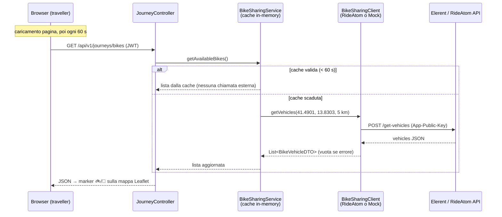

# Integrazione Elerent (bike sharing) in OMNIMOVE

> Versione inglese: [elerent_en.md](elerent_en.md)

Elerent gestisce il servizio di bike/scooter sharing a Cassino sulla piattaforma
**ATOM Mobility** (API "RideAtom": <https://app.rideatom.com/api/docs>, tag *Sharing*).

OMNIMOVE mostra i mezzi Elerent disponibili e le zone operative sulla mappa del
traveller, **in sola lettura**: nessuno sblocco, nessun pagamento, nessuna scrittura
verso Elerent. L'integrazione vive interamente in `omnimove-backend` — CASSITRACK
non è coinvolto (le bici non sono flotta monitorata, sono dati di disponibilità).

Poiché al momento **non disponiamo di una App-Public-Key**, il sistema parte con un
provider **simulato** (mock) che genera una flotta realistica su Cassino. Il passaggio
al servizio reale non richiede modifiche al codice: solo configurazione.

## Chi è chi: Elerent, ATOM Mobility, RideAtom

I tre nomi che compaiono in questo documento giocano ruoli diversi:

- **Elerent** è l'*operatore*: possiede fisicamente le bici e i monopattini a
  Cassino e gestisce il servizio verso i clienti (app, tariffe, assistenza).
- **ATOM Mobility** è il *fornitore di tecnologia*: un'azienda (con sede a Riga,
  Lettonia) che offre una piattaforma software "white-label" per servizi di
  sharing di bici, monopattini, scooter e auto. Un operatore come Elerent non
  costruisce app, backend, gestione flotta e pagamenti da zero: li "affitta" da
  ATOM, che gli fornisce l'app brandizzata col suo nome, la dashboard di
  gestione e le API.
- **RideAtom** (`app.rideatom.com`) è il dominio dell'infrastruttura API di
  ATOM. Le API documentate su <https://app.rideatom.com/api/docs> non sono
  quindi API "di Elerent" in senso stretto, ma le API della piattaforma ATOM,
  identiche per tutti gli operatori che la usano. La **App-Public-Key** serve
  esattamente a questo: identifica l'installazione di *quale* operatore si sta
  interrogando — nel nostro caso quella di Elerent.

Questa struttura spiega due scelte che ritroverai più avanti: il
`RideAtomClient` fa parsing *difensivo* dei campi, perché le risposte possono
variare leggermente tra installazioni e versioni della piattaforma (§1); e vale
la pena chiedere se l'installazione espone un feed **GBFS**, perché molte
installazioni ATOM lo offrono di serie (§4.1).

---

## 1. Come attivare l'integrazione reale

### Passo 1 — Ottenere la chiave

Richiedere a Elerent (o ad ATOM Mobility) la **App-Public-Key** dell'installazione.
Tutti gli endpoint del tag *Sharing* la richiedono nell'header `App-Public-Key`.
Per i due endpoint che usiamo la sola public key è sufficiente: **non serve** alcun
token utente.

> Consiglio: chiedere anche se l'installazione espone un **feed GBFS** (standard
> aperto, molte installazioni ATOM lo hanno). In tal caso conviene aggiungere una
> terza implementazione `GbfsClient` della stessa interfaccia — vedi §4.

### Passo 2 — Configurare le variabili d'ambiente

```bash
ELERENT_API_MOCK=false
ELERENT_PUBLIC_KEY=<chiave fornita da Elerent>
# opzionali:
ELERENT_API_URL=https://app.rideatom.com/openapi/v1.0/sharing   # default
```

La configurazione corrispondente è in `omnimove-backend/src/main/resources/application.yml`,
blocco `elerent.api` (base-url, public-key, mock, radius-km).

### Passo 3 — Riavviare omnimove-backend

All'avvio il log indica quale provider è attivo:

- `MockElerentClient active — N simulated vehicles in Cassino …` → mock
- `RideAtomClient → https://… (key configured)` → API reale

Non serve altro: frontend, endpoint REST e service sono identici nei due casi.

### Endpoint RideAtom utilizzati (sola lettura)

| Endpoint | Auth | Uso |
|---|---|---|
| `POST /get-vehicles` — body `{user_latitude, user_longitude, radius_in_km}` | Solo public key | Posizioni dei mezzi: id, targa (`nr`), batteria, tipo, coordinate |
| `POST /get-zones` | Solo public key | Zone operative/divieto di sosta: poligono o cerchio, colore, titolo |

Sono volutamente **esclusi** `start-ride`, `end-ride`, `pause`, `send-vehicle-commands`,
`purchase`: sono operazioni di scrittura, richiedono un token utente e appartengono a
una fase futura (handoff con deep-link verso l'app Elerent).

---

## 2. Flusso dati Elerent → OMNIMOVE



Componenti (tutti in `omnimove-backend`):

| Componente | File | Ruolo |
|---|---|---|
| Client (interfaccia) | `client/BikeSharingClient.java` | Contratto read-only: `getVehicles()`, `getZones()` |
| Client reale | `client/RideAtomClient.java` | Chiama RideAtom; parsing tollerante; su errore → lista vuota |
| Client mock | `client/MockElerentClient.java` | Flotta simulata deterministica (seed fisso) su punti reali di Cassino |
| Service | `service/BikeSharingService.java` | Cache TTL: 60 s mezzi, 10 min zone |
| REST | `controller/JourneyController.java` | `GET /api/v1/journeys/bikes`, `GET /api/v1/journeys/bikes/zones` |
| DTO | `dto/BikeVehicleDTO.java`, `dto/BikeZoneDTO.java` | Formato snake_case verso il browser |
| Frontend | `static/omnimove-traveller.js` | Marker, zone, polling 60 s, filtro con i chip modalità |

Gli endpoint sono protetti come tutti i `/api/v1/journeys/**`: serve un utente
autenticato (TRAVELLER o ADMIN, JWT nel header `Authorization`).

---

## 3. Approccio: quando partono le richieste? I dati vengono conservati?

### Quando OMNIMOVE contatta il server Elerent (anche simulato)

Il browser **non parla mai direttamente con Elerent**: chiama solo il backend
OMNIMOVE. Le chiamate verso Elerent partono esclusivamente dal
`BikeSharingService`, ed è lui a decidere *quando*:

1. Il frontend interroga `GET /journeys/bikes` al caricamento della pagina e poi
   **ogni 60 secondi** (polling), più un refresh delle zone una sola volta.
2. Il service risponde **dalla cache** se il dato ha meno di 60 secondi
   (10 minuti per le zone, che cambiano raramente).
3. Solo a cache scaduta parte **una** chiamata `POST /get-vehicles` verso Elerent.

Conseguenza: **al massimo ~1 richiesta al minuto verso Elerent, indipendentemente
dal numero di utenti connessi**. Cento browser che fanno polling generano sempre
la stessa singola chiamata upstream. Questo protegge l'API del provider (ed
eventuali rate limit) e rende il costo dell'integrazione costante.

Con il mock attivo il "server Elerent" è una classe locale: il flusso e i tempi
sono identici, semplicemente `getVehicles()` restituisce la flotta simulata senza
uscire in rete. Per questo la demo si comporta esattamente come farà la versione
reale.

### Persistenza: i dati vengono conservati localmente?

**No.** I dati Elerent sono volutamente **effimeri**:

- vivono solo nella **cache in-memory** del processo (`BikeSharingService`:
  due campi + timestamp, stesso pattern del `WeatherService`);
- **non** vengono scritti in PostgreSQL, Redis né InfluxDB;
- a ogni riavvio del backend la cache riparte vuota e viene ripopolata alla
  prima richiesta;
- in caso di errore (chiave mancante, API irraggiungibile, timeout) il client
  logga un warning e restituisce lista vuota: la mappa resta funzionante, il
  layer bici semplicemente scompare. Nessuna eccezione risale mai al browser.

La scelta è deliberata: la posizione di una bici libera è un dato "usa e getta"
che invecchia in secondi; conservarlo non avrebbe valore per il journey planner e
creerebbe solo dati stantii. Se in futuro servissero analisi storiche
(es. disponibilità media per zona), il punto giusto dove aggiungere la scrittura è
`BikeSharingService`, verso InfluxDB, senza toccare client né controller.

---

## 4. Evoluzioni previste (fuori dallo scope attuale)

### 4.1 GBFS come sorgente dati alternativa (o aggiuntiva)

**Che cos'è.** GBFS (*General Bikeshare Feed Specification*) è lo standard
aperto per la pubblicazione dei dati di disponibilità dei servizi di mobilità
condivisa. È un insieme di semplici file JSON serviti via HTTP — quelli
rilevanti per noi sono `free_bike_status.json` (posizione, batteria e
disponibilità di ogni mezzo free-floating), `station_information.json` /
`station_status.json` (stalli, se presenti) e `geofencing_zones.json` (zone
operative e di divieto in formato GeoJSON). I feed sono pubblici per
definizione: **nessuna API key, nessuna autenticazione**, e la specifica dichiara
perfino la frequenza di polling tramite il campo `ttl`.

**Perché ci interessa.** Molte installazioni ATOM Mobility espongono un feed
GBFS accanto all'API proprietaria RideAtom. Se quella di Elerent lo fa, GBFS
diventa la sorgente preferibile per il nostro caso d'uso in sola lettura: è
esattamente il dato che ci serve, senza chiavi da ottenere e senza dipendere
dalle forme di risposta non documentate di RideAtom (il nostro `RideAtomClient`
fa parsing difensivo proprio perché i nomi dei campi variano tra installazioni).

**Come implementarlo.** È lo scenario per cui il design attuale è stato pensato:

1. aggiungere `client/GbfsClient.java` che implementa `BikeSharingClient` — due
   chiamate GET (`free_bike_status.json`, `geofencing_zones.json`), mappate sui
   DTO esistenti `BikeVehicleDTO` / `BikeZoneDTO`;
2. introdurre una proprietà `elerent.api.provider` (`mock` | `rideatom` | `gbfs`)
   e usarla nelle annotazioni `@ConditionalOnProperty` per scegliere
   l'implementazione (oggi lo switch è il booleano `elerent.api.mock`; un enum a
   tre valori è la generalizzazione naturale);
3. non cambia nient'altro: `BikeSharingService` (con la sua cache),
   `JourneyController`, i DTO e tutto il frontend sono agnostici rispetto al
   provider.

La roadmap (`email_team_roadmap.md`) rimanda già a un esempio GBFS funzionante
basato su Dott Roma, utilizzabile sia come feed di riferimento durante lo
sviluppo sia come test di compatibilità del client.

### 4.2 Disponibilità reale nel journey planning — ✅ implementato

`planBike()` e `planScooter()` sono ora ancorati alla flotta reale (o mock)
tramite l'helper condiviso `planSharedVehicle()` in `JourneyPlannerService`:

- **Tratta verso il mezzo più vicino**: `BikeSharingService.findNearest()`
  sceglie il mezzo disponibile più vicino del tipo giusto; una tratta WALK
  (origine → mezzo, con coordinate per la mappa) viene anteposta alla tratta in
  bici, così la durata totale include la camminata e il confronto con BUS/WALK
  è onesto. Se il mezzo è a meno di 40 m la tratta WALK viene omessa.
- **Disponibilità onesta**: se nessun mezzo è entro la distanza pedonale
  massima, l'opzione sparisce e un avviso spiega il perché. La distanza massima
  è una **preferenza utente** (`max_bike_walk_metres`, default **500 m**,
  migration V16) modificabile nel pannello Preferenze (250 m–1 km). Con
  *preferisci bici al bus* attivo, il fallback già esistente di `plan()`
  ricalcola automaticamente il bus.
- **La batteria informa, non filtra mai**: un mezzo con poca batteria viene
  comunque proposto, con le tacchette renderizzate dal frontend — verde 3
  tacchette ≥ 60 % (carica), gialla 2 tacchette 25–59 % (critica), rossa 1
  tacchetta 10–24 % / 0 tacchette < 10 % (scarica). Lo stesso badge compare nei
  popup della mappa e nella timeline del viaggio (`bike_battery_pct`
  sull'opzione).
- **Controllo zone sulla destinazione**: `checkDestinationZones()` (ray-casting
  point-in-polygon più zone circolari, `util/GeoUtils`) imposta `bike_warning`
  sull'opzione quando la destinazione è fuori dalla zona operativa o dentro una
  zona di divieto di sosta; la card lo mostra come badge di avviso.

Tutto questo consuma gli stessi dati in cache già usati dalla mappa, quindi
**non aggiunge alcuna chiamata** verso Elerent. L'opzione trasporta anche
`bike_id`, `bike_plate` e `bike_walk_metres`, mostrati nel summary della card e
nella timeline.

### 4.3 Sblocco e pagamenti: solo handoff con deep-link

**Il confine.** Tutto ciò che è descritto in questo documento è volutamente in
sola lettura. *Noleggiare* davvero un mezzo (`start-ride`, `end-ride`, `pause`,
`purchase`…) è un problema di classe diversa: quegli endpoint agiscono per conto
di uno specifico utente, richiedono un token `Authorization` personale emesso
dal sistema account di Elerent/ATOM e muovono denaro reale con effetti nel mondo
fisico (una bici si sblocca davvero).

**Livello 1 — handoff con deep-link (il passo previsto).** Quando il traveller
tocca una bici, OMNIMOVE apre l'app Elerent (o la sua pagina store / fallback
web) tramite deep link, idealmente preselezionando il mezzo scelto. Identità,
pagamento, sblocco e responsabilità restano tutti in capo a Elerent, dove già
funzionano. È il livello 1 della roadmap pagamenti (`payments_integration_*.md`,
citata dalla roadmap di team) e costa pochissimo: uno schema URL nel popup,
nessun lavoro backend.

**Perché OMNIMOVE non deve mai sbloccare con la sola public key.** La
`App-Public-Key` identifica l'*applicazione*, non un *utente*. Provare a pilotare
le corse attraverso di essa (es. con la variante `user_id` + secret key
dell'API) significherebbe far custodire a OMNIMOVE le credenziali segrete di
Elerent e farlo agire da intermediario di pagamento: si accollerebbe obblighi
PCI e di responsabilità, l'assistenza clienti per le corse bloccate e i flussi
di rimborso — nulla di tutto ciò appartiene a un journey planner. Un'integrazione
più profonda (sblocco in-app, livello 2+) va costruita esclusivamente su un
flusso per-utente in stile OAuth concordato con Elerent, in cui il cliente si
autentica presso Elerent e OMNIMOVE non tocca mai le sue credenziali né i suoi
strumenti di pagamento.
