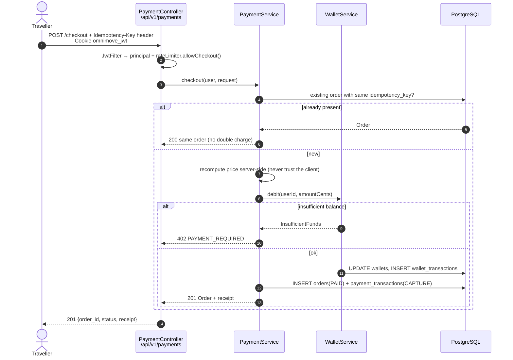

# OMNIMOVE — Buying mobility services: how to integrate with operators

> **Goal.** Explain how OMNIMOVE can let a traveller actually ***buy*** the service the journey
> planner just proposed: a bus ticket, a scooter or a bike ride. This is the "payments" side of
> a **MaaS** (Mobility as a Service) platform.
> A teaching document: first the *concepts*, then the *project plan*, then the *technical design*
> on the stack we already have. **No code here: this is a design document.**
> Sibling documents (do not edit them from here): `cassitrack_integration_{it,en}.md` and
> `omnimove_integration_{it,en}.md`.

---

## 0. The problem in one sentence

Today OMNIMOVE **proposes** an option ("Elerent e-scooter, 12 min, ~€3.50") and then **abandons
the user**: to actually travel they must open another app, sign up, and pay. A real MaaS closes
the loop: *plan → book → pay → ride*. The tricky part is that **money is not a technical
detail**: the moment OMNIMOVE touches money it enters a world of rules (PSD2, PCI-DSS,
electronic receipts) and of contracts with operators. That is why integration is tackled
**in levels**, from cheapest to heaviest.

---

## 1. The three integration levels

### 1.1 Level 1 — *Deep-link handoff* (recommended first step)

**Idea.** OMNIMOVE **never touches money**. It shows the option, estimates the price, and when
the user taps "Book" it **hands them over** to the operator's app/site with a link that already
carries the context (vehicle, station, line). Payment happens inside the operator's app.

**Where the links come from.** The **GBFS** standard (*General Bikeshare Feed Specification*,
MobilityData) defines a `rental_uris` field both in `station_information.json` and in
`vehicle_status.json` (`free_bike_status.json` in the 2.x versions). It is an object with three
optional keys — **`android`**, **`ios`**, **`web`** — i.e. deep links *already provided by the
operator*: use them as they are, never build them by hand.

```json
{
  "bike_id": "elerent-scooter-4471",
  "lat": 41.4901, "lon": 13.8302,
  "vehicle_type_id": "escooter",
  "current_range_meters": 18400,
  "rental_uris": {
    "android": "https://dott.onelink.me/…?vehicle=4471&city=cassino",
    "ios":     "https://dott.onelink.me/…?vehicle=4471&city=cassino",
    "web":     "https://ridedott.com/unlock?vehicle=4471"
  }
}
```

For the **bus** the equivalent is a **ticket-shop URL**: the operator's (or the Lazio regional
scheme's) purchase page, possibly with the line preselected. Golden rule: prefer `android`/`ios`
when the app is installed, otherwise fall back to `web`; if `rental_uris` is missing, fall back
to a **configured** generic URL, never a hardcoded one (§3.5).

**Pros** — zero **PCI-DSS** scope and zero **PSD2** obligations (you are not in the payment
flow); no contract needed (GBFS deep links are public and designed for aggregators);
deliverable in **days**; no chargebacks, refunds or disputes to handle.

**Cons** — **broken experience** (the user leaves OMNIMOVE and may not come back); OMNIMOVE
**does not know** whether the purchase succeeded, so statistics and history stay incomplete; no
revenue for the platform.

**Effort:** ~1–2 person-weeks (GBFS feed + button + fallback + click tracking).

### 1.2 Level 2 — Partner / reseller APIs

**Idea.** You sign a commercial agreement: the operator exposes **purchase APIs** to OMNIMOVE,
or a **voucher**/prepaid-code system. OMNIMOVE becomes a sales channel; the money stays with the
operator or flows through a dedicated account with periodic settlement.

Typical variants: **direct sales** (`POST /partners/{id}/tickets` with the OMNIMOVE user ID → a
QR ticket valid on the operator's validators); **voucher pool** (OMNIMOVE buys a batch of rides
up front and consumes one per user — simple accounting, rigid operationally); **data
aggregators** such as **Fluctuo**, useful to cover many operators under a single contract but
typically providing **data, not sales**. For Italian bus ticketing the realistic channel is the
operator itself or the regional ticketing scheme.

**Pros** — nearly integrated experience (the user stays in OMNIMOVE), purchase confirmation
available, limited financial risk (usually no card data handled).

**Cons** — **one contract per operator** (slow onboarding, different terms and APIs); you need a
**sandbox** with test credentials from each partner; continuous maintenance.

**Effort:** 1–3 months **per operator**, mostly non-technical (agreements, legal).

### 1.3 Level 3 — Full in-app payments

**Idea.** OMNIMOVE collects money directly through a **PSP** (*Payment Service Provider*) and
then **settles** with the operators. This is the mature MaaS model. Candidate PSPs: **Stripe**
(excellent DX, `Stripe Connect` for marketplaces), **Adyen** (strong on enterprise/omnichannel),
**Nexi** (the most relevant player on the Italian market, integrated with local banks and POS
terminals), plus the **PayPal** and **Satispay** wallets (Satispay is very widespread in Italy
for small amounts — ideal for a €1.00 ticket).

What it really entails:

- **PSD2 / SCA** — the European directive mandates *Strong Customer Authentication*: two
  factors, in practice **3-D Secure 2** handled by the PSP. Exemptions exist (< €30, low-risk
  transactions, recurring MITs) but **the card issuer decides**: your code must *always* handle
  "a challenge is required" and resume the flow afterwards.
- **PCI-DSS** — if card data passes through your servers the scope explodes. Standard solution:
  *hosted checkout* or hosted fields (Stripe Checkout/Elements, Adyen Drop-in, Nexi XPay Build):
  the browser talks directly to the PSP and the backend only ever receives a **token**.
  **Never a PAN at rest in the database.** That choice qualifies you for the **SAQ-A**
  questionnaire.
- **Marketplace / split payment** — with several operators you must split the takings. Stripe
  Connect offers *destination charges* / *separate charges and transfers*: OMNIMOVE collects,
  keeps a fee and transfers the rest. Alternative: collect everything and **settle periodically**
  (monthly invoice), technically simpler but OMNIMOVE then acts as a payment intermediary and the
  regulatory framework must be assessed (agent / payment institution).
- **Refunds** — ride not taken, bus cancelled, scooter not unlocked: you need a refund endpoint
  (full/partial), traced and reconciled with the operator.
- **Receipts and Italian specifics** — travel documents have their own rules; for services sold
  in your own name the **electronic receipt** (*corrispettivi telematici* / *documento
  commerciale*) obligations kick in. Payouts to operator accounts travel over **SEPA Credit
  Transfer** (IBAN), with **SDD** mandates if direct debit is used. **Settle this with an
  accountant.**

**Pros** — complete experience, a single cart for bus + sharing, possible revenue, full purchase
history (real analytics, refunds, customer support).
**Cons** — heavy compliance, legal liability, fraud and chargebacks; PSP fees (~1.4 % + €0.25
intra-EU) are brutal on €1 tickets; you need a dedicated, standing role.

**Effort:** 3–6 months plus recurring costs. **Out of scope for a course project.**

### 1.4 Side-by-side comparison

| | **L1 Deep link** | **L2 Partner API** | **L3 In-app** |
|---|---|---|---|
| Who collects | Operator | Operator / dedicated account | OMNIMOVE |
| PCI-DSS | None | None/low | SAQ-A (hosted checkout) |
| PSD2 / SCA | Not applicable | Not applicable | **Mandatory** |
| Contracts | No | **Yes, per operator** | Yes + PSP |
| Purchase confirmation | ❌ | ✅ | ✅ |
| Effort | Days | Months/operator | Quarters |
| **Fit for the course** | ✅ **Yes** | Feasibility study | Theory only |

---

## 2. Recommended roadmap for the project

**Phase A — September 2026 demos (to be done).**
1. **Simulated wallet**: fake per-user balance, fake top-up, fake checkout producing an order
   and a receipt. Its job is to show the end-to-end flow **without money**.
2. **Real deep links** where available: "Open with operator" on the BIKE/SCOOTER options and a
   ticket-shop link on the BUS. If the user takes the deep link, the order is recorded as
   `EXTERNAL_HANDOFF` (with no confirmed amount).
3. **Make the dual mode obvious in the UI**: a badge reading "SIMULATED PAYMENT — no real
   charge". Non-negotiable: a demo that *looks* like it takes real money is a liability, not a
   feature.

**Phase B — Future work (thesis / continuation).**
4. Contact **Elerent** (the sharing operator active in Cassino) and the **local bus operator**:
   ask for purchase APIs or vouchers plus a sandbox (§4).
5. If a sandbox arrives → **Level 2** with a single operator, as a proof of concept.
6. **Level 3** only as an **analysis chapter** (PSP, costs, compliance): document it, do not
   implement it.

**Exit criterion for Phase A:** a logged-in user completes
*plan → select → simulated checkout → receipt visible in history*.

---

## 3. Designing the simulated payment flow

> Consistent with the existing `omnimove-backend` code (package `it.unicas.omnimove`),
> but **not to be implemented now**.

### 3.1 Flow



For **Level 1** the flow is much shorter: OMNIMOVE reads `rental_uris` from the GBFS feed,
records an `order(status=EXTERNAL_HANDOFF)` and redirects the user to the deep link
(`android`/`ios` with `web` fallback). From there on **OMNIMOVE never learns the outcome** — the
known Level 1 limitation.

### 3.2 Proposed entities (same style as `JourneyLog`/`AppSetting`)

| Entity | Table | Main fields |
|---|---|---|
| `Order` | `orders` | id, userId, journeyLogId (optional FK to `journey_log`), mode, provider (`SIMULATED`/`ELERENT`/`BUS_OP`), amountCents, currency, status, idempotencyKey **UNIQUE**, externalRef, createdAt, updatedAt |
| `PaymentTransaction` | `payment_transactions` | id, orderId, type (`AUTH`/`CAPTURE`/`REFUND`), status, amountCents, pspReference, failureReason, createdAt |
| `Wallet` | `wallets` | PK = `user_id` (1:1 with `User`, like `UserPreferences`), balanceCents, currency, updatedAt |
| `WalletTransaction` | `wallet_transactions` | id, userId, orderId (nullable), direction (`CREDIT`/`DEBIT`), amountCents, balanceAfterCents, reason, createdAt |

Design choices you should be able to defend at the exam: **amounts in cents (`BIGINT`)**, never
`double` — `0.1 + 0.2 != 0.3` in floating point and you do not get money wrong
(`JourneyLog.costEuros` stays a `Double` because it is an *estimate*); statuses
`PENDING → PAID → REFUNDED` / `FAILED` / `CANCELLED` / `EXTERNAL_HANDOFF`; `idempotencyKey` with
a **UNIQUE** constraint, because it is the database — not the code — that prevents a double
charge on a double click or a network retry; **no card data** in any table, not even encrypted.

### 3.3 Flyway migration

The latest applied is **V15** → add **`V16__payments.sql`** (never edit earlier files: they are
checksum-immutable and `ddl-auto: validate` requires entities to match the DDL exactly). It
creates the four tables, the indexes (`orders(user_id, created_at DESC)`, UNIQUE on
`idempotency_key`), `CHECK` constraints on the statuses and `CHECK (amount_cents >= 0)`, and
inserts the runtime flags:

```sql
INSERT INTO app_settings (setting_key, setting_value) VALUES
    ('payments.mode',               'SIMULATED'),   -- SIMULATED | DISABLED | LIVE
    ('payments.deeplinks.enabled',  'true'),
    ('payments.wallet.topup_cents', '2000')
ON CONFLICT (setting_key) DO NOTHING;
```

The flags are read through a service modelled on `GoogleApiSettingsService`
(`ConcurrentHashMap` cache, write-through), so an admin can switch payments off at runtime.

### 3.4 Proposed endpoints — `/api/v1/payments`

Thin controller (`@RestController @RequiredArgsConstructor @Tag`), logic in the service,
`@AuthenticationPrincipal UserDetails principal`, DTOs at the boundary — **never entities in
responses**.

| Method | Path | Description |
|---|---|---|
| `GET` | `/wallet` | balance and last 20 movements |
| `POST` | `/wallet/topup` | **simulated** top-up (max amount from `app_settings`) |
| `POST` | `/checkout` | creates the order and debits the wallet; **requires `Idempotency-Key`** |
| `GET` | `/orders` | the user's order history (paginated) |
| `GET` | `/orders/{id}/receipt` | receipt (JSON; PDF later) |
| `POST` | `/orders/{id}/refund` | simulated refund (ADMIN only) |
| `POST` | `/handoff` | records an `EXTERNAL_HANDOFF` and returns the deep link |

Request (`snake_case` JSON via `@JsonProperty`, like the rest of the project) and responses:

```json
// POST /api/v1/payments/checkout
{
  "mode": "SCOOTER", "provider": "SIMULATED", "journey_log_id": 8421,
  "origin_name": "Cassino Railway Station", "dest_name": "Folcara Campus",
  "distance_km": 3.4, "quoted_amount_cents": 350, "currency": "EUR"
}
```

```json
// 201 Created
{
  "order_id": "b6f0c2a1-2f8e-4f4a-9c1e-3d2b7a5e91d4",
  "status": "PAID", "mode": "SCOOTER", "provider": "SIMULATED",
  "amount_cents": 350, "currency": "EUR",
  "wallet_balance_cents": 1650, "simulated": true,
  "receipt": {
    "number": "OM-2026-000418", "issued_at": "2026-09-14T10:22:31Z",
    "lines": [
      { "description": "Elerent e-scooter · unlock",        "amount_cents": 100 },
      { "description": "Elerent e-scooter · 10 min × 0.25", "amount_cents": 250 }
    ]
  }
}
```

```json
// 402 Payment Required
{ "error": "INSUFFICIENT_FUNDS", "message": "Wallet balance too low.",
  "required_cents": 350, "available_cents": 120 }
```

### 3.5 Fitting into what already exists

- **Security** — add `/api/v1/payments/**` to the *"any authenticated"* block in
  `SecurityConfig` (next to `/api/v1/journeys/**`); refunds stay ADMIN via `@PreAuthorize`. No
  changes to `JwtFilter`/`JwtUtil`.
- **Rate limiting** — new buckets in `RateLimiterService`: `allowCheckout(email)` 10/user/hour
  and `allowTopup(email)` 5/user/hour. Careful: the rate limiter is *fail-open* when Redis is
  down — for real payments (L3) it should be made *fail-closed*.
- **Audit** — new events in `SecurityAuditService` (`orderCreated`, `orderPaid`, `refundIssued`,
  `topupPerformed`): masked log line plus unmasked row in `security_audit_events`.
- **Pricing** — reuse the existing properties (`elerent.bike.unlock`, `elerent.bike.per-minute`,
  `elerent.scooter.unlock`, `elerent.scooter.per-minute`, `COST_BUS`) and **recompute the amount
  server-side**, exactly as the Green Index is already recomputed in `POST /journeys/select`. The
  client's `quoted_amount_cents` only serves to detect a mismatch (→ `409 PRICE_CHANGED`).
- **URLs and keys** — deep links and ticket-shop URLs in `app_settings` / environment variables
  (`.env.example`), **never** constants in code: same rule as Google/Weather/Anthropic.
- **Analytics** — a new InfluxDB measurement `purchase` (tags `mode`, `provider`; field
  `amount_cents`) written by `JourneyEventService`, so the admin dashboard can show simulated
  revenue next to mode distribution and Green Index.
- **Graceful degradation** — with `payments.mode = DISABLED` the endpoints return `503` and the
  UI hides the buttons: same philosophy as "Cassitrack offline → empty list".

---

## 4. How to approach the companies

Contact **Elerent** (sharing operator active in Cassino) and the **local bus operator**. A short,
technical email with one clear ask. Template:

> **Subject:** University of Cassino — OMNIMOVE MaaS project: ticket purchase integration
>
> Hello, we are a team at the University of Cassino and Southern Lazio. We are developing
> **OMNIMOVE**, a multimodal journey planner for the city of Cassino (bus, bike, scooter,
> walking) for teaching and research purposes. Your service already appears among the options we
> present to users. We would like to explore an integration that lets the user **purchase** the
> service. A few questions:
> 1. Do you offer **public or partner APIs** for a third party to purchase a ticket/ride?
>    Alternatively, do you run a **voucher or prepaid-code** scheme for aggregators?
> 2. Do you publish a **GBFS** feed (or GTFS/NeTEx for public transport)? Can you confirm the
>    **`rental_uris`** deep-link fields are present, which we would use for the handoff?
> 3. Is a **sandbox environment** with **test credentials** available, so we can develop without
>    real transactions?
> 4. What are the indicative **commercial terms**: channel commission, timing and mechanics of
>    **settlement**, handling of **refunds** and disputes?
> 5. Are there **branding**, terms-of-use or user-data requirements we must respect?
>
> In the first phase (September 2026 demos) we will **not handle real money**: we will use a
> simulated wallet and, where possible, deep links into your app. Happy to set up a 30-min call.

**Practical tips:** ask for the **deep link before the API** (it costs them nothing and you get
it fast); talk to *partnerships / business development*, not customer support; attach a
screenshot of the planner (it makes the benefit concrete — traffic sent their way); state in
writing that this is an **academic, non-commercial** project.

---

## 5. Security & compliance checklist

- [ ] **HTTPS everywhere** (HSTS already enabled, `COOKIE_SECURE=true` in production); no payment
      endpoint reachable in the clear.
- [ ] **Idempotency**: `Idempotency-Key` header required on `POST /checkout`, stored with a
      `UNIQUE` constraint; a retry returns the **same** order, not a new one.
- [ ] **Server-side price recomputation**, always: the client proposes, the server decides.
- [ ] **No card data at rest** — no PAN, no CVV, no expiry, not even encrypted; at L3 use hosted
      checkout/tokenization exclusively.
- [ ] **Webhook signature verification** (L2/L3): the PSP's HMAC compared in **constant time**
      against the *raw body* (not the re-serialised JSON), plus a timestamp check against
      *replay*. An unverified webhook is an endpoint anyone can use to "confirm" payments that
      never happened. Webhooks must also be **idempotent**: events are delivered more than once.
- [ ] **Transactionality**: wallet debit and order creation in the **same** transaction
      (`@Transactional`), with a pessimistic lock on the wallet row against concurrent races.
- [ ] **Rate limiting** on checkout and top-up, **fail-closed** when money is involved.
- [ ] **Audit** every monetary operation (who, when, how much, from which IP); never amounts plus
      PII in clear in application logs — use order IDs.
- [ ] **GDPR on purchase history**: legal basis = performance of a contract; **minimisation** (do
      not store the full itinerary if origin/destination suffices); a declared **retention**
      period (e.g. 24 months, then anonymisation); `DELETE /auth/account` must **anonymise**
      orders (accounting obligations) rather than cascade-delete them; right to **portability** →
      JSON/CSV export of the history. Privacy policy updated if PSPs or third-party operators
      appear (processors or independent controllers: this must be declared).
- [ ] **Tests**: insufficient balance, double click, refund above the amount, negative amounts,
      mismatched currency, another user's order (`403`).

---

## 6. References

**PSPs and payments** — Stripe Docs (*Payments*, *Checkout*, *Connect* for marketplace/split)
`https://docs.stripe.com`; *Idempotent requests* `https://docs.stripe.com/api/idempotent_requests`;
*Webhook signatures* `https://docs.stripe.com/webhooks/signatures`; Adyen Docs (*Online payments*,
*Drop-in*, *Platforms*) `https://docs.adyen.com`; Nexi Developer Portal / XPay
`https://developer.nexi.it`; PayPal Developer `https://developer.paypal.com`; Satispay for
Business `https://developers.satispay.com`.

**Regulation** — EBA/PSD2 *RTS on Strong Customer Authentication* and 3-D Secure 2 (EMVCo); PCI
Security Standards Council, *PCI DSS v4.0* and the **SAQ-A** questionnaire
`https://www.pcisecuritystandards.org`; GDPR, Reg. (EU) 2016/679 arts. 5, 6, 17, 20; Italian
Revenue Agency, electronic receipts (*corrispettivi telematici*, *documento commerciale*).

**Mobility data** — **GBFS** (MobilityData), specification and the **`rental_uris`** section in
`station_information.json` and `vehicle_status.json` `https://gbfs.org/specification/reference/`;
*deep links best practices* `https://github.com/MobilityData/gbfs`; Fluctuo, European
shared-mobility data aggregator `https://fluctuo.com`; GTFS / NeTEx / SIRI for public transport
(already used by CASSITRACK, see `cassitrack_integration_en.md`).

**Inside the project** —
`omnimove-backend/src/main/java/it/unicas/omnimove/config/SecurityConfig.java`,
`.../service/RateLimiterService.java`, `.../service/GoogleApiSettingsService.java`,
`omnimove-backend/src/main/resources/db/migration/` (latest applied: `V15`).
