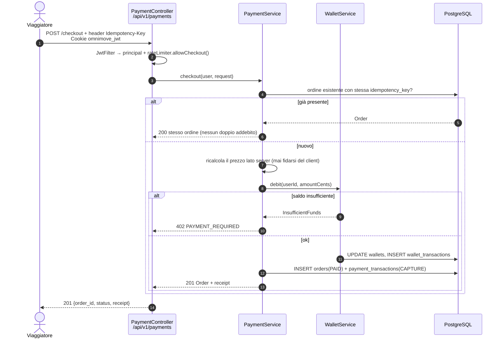

# OMNIMOVE — Acquisto di servizi di mobilità: come integrarsi con gli operatori

> **Obiettivo.** Spiegare come OMNIMOVE può permettere al viaggiatore di ***comprare*** il
> servizio che il journey planner gli ha proposto: biglietto bus, corsa in monopattino o in
> bici. È il lato "pagamenti" di una piattaforma **MaaS** (Mobility as a Service).
> Documento didattico: prima i *concetti*, poi il *piano di progetto*, poi il *disegno tecnico*
> sullo stack che già abbiamo. **Nessuna riga di codice: questo è un documento di progettazione.**
> Documenti fratelli (non modificarli da qui): `cassitrack_integration_{it,en}.md` e
> `omnimove_integration_{it,en}.md`.

---

## 0. Il problema in una frase

Oggi OMNIMOVE **propone** un'opzione ("Elerent e-scooter, 12 min, ~€3.50") ma poi **abbandona
l'utente**: per partire davvero deve aprire un'altra app, registrarsi, pagare. Un MaaS vero
chiude il cerchio: *pianifica → prenota → paga → viaggia*. Il punto delicato è che **il denaro
non è un dettaglio tecnico**: appena OMNIMOVE tocca i soldi entra in un mondo di regole (PSD2,
PCI-DSS, scontrino elettronico) e di contratti con gli operatori. Per questo l'integrazione si
affronta **a livelli**, dal più economico al più impegnativo.

---

## 1. I tre livelli di integrazione

### 1.1 Livello 1 — *Deep-link handoff* (consigliato come primo passo)

**Idea.** OMNIMOVE **non tocca mai i soldi**. Mostra l'opzione, stima il prezzo, e quando
l'utente preme "Prenota" lo **consegna** all'app/sito dell'operatore con un link che contiene
già il contesto (veicolo, stazione, linea). Il pagamento avviene dentro l'app dell'operatore.

**Da dove arrivano i link.** Lo standard **GBFS** (*General Bikeshare Feed Specification*,
MobilityData) prevede il campo `rental_uris` sia in `station_information.json` sia in
`vehicle_status.json` (`free_bike_status.json` nelle versioni 2.x). È un oggetto con tre chiavi
facoltative — **`android`**, **`ios`**, **`web`** — cioè deep link *già pronti dall'operatore*:
si usano così come sono, non si costruiscono a mano.

```json
{
  "bike_id": "elerent-scooter-4471",
  "lat": 41.4901, "lon": 13.8302,
  "vehicle_type_id": "escooter",
  "current_range_meters": 18400,
  "rental_uris": {
    "android": "https://dott.onelink.me/…?vehicle=4471&city=cassino",
    "ios":     "https://dott.onelink.me/…?vehicle=4471&city=cassino",
    "web":     "https://ridedott.com/unlock?vehicle=4471"
  }
}
```

Per il **bus** l'equivalente è una **URL di ticket shop**: la pagina di acquisto dell'operatore
(o del circuito regionale del Lazio), eventualmente con la linea preselezionata. Regola d'oro:
preferisci `android`/`ios` se l'app è installata, altrimenti fallback su `web`; se `rental_uris`
manca, fallback su una URL generica **configurata**, mai *hardcoded* (§3.5).

**Pro** — zero perimetro **PCI-DSS** e zero obblighi **PSD2** (non sei nel flusso di pagamento);
nessun contratto necessario (i deep link GBFS sono pubblici e pensati per gli aggregatori);
implementabile in **giorni**; nessun rischio di *chargeback*, rimborsi o contenziosi.

**Contro** — esperienza **spezzata** (l'utente esce da OMNIMOVE e magari non torna); OMNIMOVE
**non sa** se l'acquisto è riuscito, quindi statistiche e storico restano incompleti; nessun
ricavo per la piattaforma.

**Sforzo:** ~1–2 settimane-uomo (feed GBFS + bottone + fallback + tracciamento click).

### 1.2 Livello 2 — API partner / rivenditore (*reseller*)

**Idea.** Si firma un accordo commerciale: l'operatore espone ad OMNIMOVE delle **API di
acquisto** o un sistema di **voucher**/codici prepagati. OMNIMOVE diventa un canale di vendita;
l'incasso resta all'operatore o passa da un conto dedicato con regolazione periodica.

Varianti tipiche: **vendita diretta** (`POST /partners/{id}/tickets` con l'ID utente OMNIMOVE →
biglietto QR valido sui validatori dell'operatore); **voucher pool** (OMNIMOVE compra a monte un
lotto di corse e ne "consuma" uno per utente — semplice contabilmente, rigido operativamente);
**aggregatori di dati** come **Fluctuo**, utili per coprire più operatori con un solo contratto
ma che forniscono tipicamente **dati, non vendita**. Per il ticketing bus in Italia il canale
realistico è l'operatore stesso o lo schema di bigliettazione regionale.

**Pro** — esperienza quasi integrata (l'utente resta in OMNIMOVE), conferma dell'acquisto
disponibile, rischio finanziario limitato (spesso nessuna carta di credito trattata).

**Contro** — **un contratto per ogni operatore** (onboarding lento, condizioni e API diverse);
serve una **sandbox** con credenziali di test da ciascun partner; manutenzione continua.

**Sforzo:** 1–3 mesi **per operatore**, in gran parte non tecnici (accordi, legale).

### 1.3 Livello 3 — Pagamenti in-app completi

**Idea.** OMNIMOVE incassa direttamente tramite un **PSP** (*Payment Service Provider*) e poi
**regola i conti** con gli operatori. È il modello dei MaaS maturi. PSP candidati: **Stripe**
(ottima DX, `Stripe Connect` per marketplace), **Adyen** (forte su enterprise/omnicanale),
**Nexi** (il più rilevante sul mercato italiano, integrato con banche e POS locali), più i
wallet **PayPal** e **Satispay** (molto diffuso in Italia per importi piccoli — perfetto per un
biglietto da 1,00 €).

Cosa comporta davvero:

- **PSD2 / SCA** — la direttiva europea impone la *Strong Customer Authentication*: due fattori,
  in pratica **3-D Secure 2** gestito dal PSP. Esistono esenzioni (< 30 €, transazioni a basso
  rischio, MIT ricorrenti) ma **decide l'emittente della carta**: il codice deve *sempre* saper
  gestire "serve una challenge" e riprendere il flusso dopo.
- **PCI-DSS** — se i dati carta transitano dai tuoi server il perimetro esplode. Soluzione
  standard: *hosted checkout* o campi ospitati (Stripe Checkout/Elements, Adyen Drop-in, Nexi
  XPay Build): il browser parla direttamente col PSP e il backend riceve solo un **token**.
  **Mai un PAN a riposo nel database.** Così ci si qualifica per il questionario **SAQ-A**.
- **Marketplace / split payment** — con più operatori serve dividere l'incasso. Stripe Connect
  offre *destination charges* / *separate charges and transfers*: OMNIMOVE incassa, trattiene
  una commissione e trasferisce il resto. Alternativa: incasso pieno e **regolazione periodica**
  (fattura mensile), tecnicamente più semplice ma OMNIMOVE diventa un intermediario di pagamento
  e va valutato il quadro normativo (agente / istituto di pagamento).
- **Rimborsi** — corsa non effettuata, bus soppresso, monopattino non sbloccato: serve un
  endpoint di rimborso (totale/parziale), tracciato e riconciliato con l'operatore.
- **Ricevute e specificità italiane** — i titoli di viaggio hanno regole proprie; per servizi
  venduti in proprio scattano gli obblighi di **corrispettivi telematici** / documento
  commerciale. I pagamenti verso i conti operatori viaggiano su **SEPA Credit Transfer** (IBAN),
  con mandati **SDD** se si usa addebito diretto. **Da concordare con un commercialista.**

**Pro** — esperienza completa, un solo carrello per bus + sharing, ricavi possibili, storico
acquisti completo (analytics reali, rimborsi, assistenza).
**Contro** — compliance pesante, responsabilità legale, frodi e chargeback; commissioni PSP
(~1,4 % + 0,25 € intra-EU) pesantissime su biglietti da 1 €; serve un ruolo dedicato stabile.

**Sforzo:** 3–6 mesi più costi ricorrenti. **Fuori portata per un progetto di corso.**

### 1.4 Confronto sintetico

| | **L1 Deep link** | **L2 Partner API** | **L3 In-app** |
|---|---|---|---|
| Chi incassa | Operatore | Operatore / conto dedicato | OMNIMOVE |
| PCI-DSS | Nessuno | Nessuno/basso | SAQ-A (hosted checkout) |
| PSD2 / SCA | Non applicabile | Non applicabile | **Obbligatorio** |
| Contratti | No | **Sì, per operatore** | Sì + PSP |
| Conferma acquisto | ❌ | ✅ | ✅ |
| Sforzo | Giorni | Mesi/operatore | Trimestri |
| **Adatto al corso** | ✅ **Sì** | Studio di fattibilità | Solo teoria |

---

## 2. Roadmap consigliata per il progetto

**Fase A — Demo di settembre 2026 (da fare).**
1. **Wallet simulato**: saldo fittizio per utente, ricarica finta, checkout finto che genera un
   ordine e una ricevuta. Serve a mostrare il flusso end-to-end **senza denaro**.
2. **Deep link reali** dove disponibili: "Apri con l'operatore" sulle opzioni BIKE/SCOOTER e
   link al ticket shop sul BUS. Se l'utente sceglie il deep link, l'ordine viene registrato come
   `EXTERNAL_HANDOFF` (senza importo confermato).
3. **Doppia modalità evidente in UI**: badge "PAGAMENTO SIMULATO — nessun addebito reale". Non
   negoziabile: una demo che *sembra* incassare davvero è un problema, non una feature.

**Fase B — Lavoro futuro (tesi / continuazione).**
4. Contatto con **Elerent** (sharing attivo a Cassino) e con l'**operatore bus locale**:
   richiesta di API di acquisto o voucher + sandbox (§4).
5. Se arriva una sandbox → **Livello 2** su un solo operatore, come proof of concept.
6. **Livello 3** solo come **capitolo di analisi** (PSP, costi, compliance): documentarlo, non
   implementarlo.

**Criterio di uscita dalla Fase A:** un utente loggato completa
*pianifica → seleziona → checkout simulato → ricevuta consultabile nello storico*.

---

## 3. Progettazione del flusso di pagamento simulato

> Coerente con il codice esistente di `omnimove-backend` (package `it.unicas.omnimove`),
> ma **da non implementare ora**.

### 3.1 Flusso



Per il **Livello 1** il flusso è molto più corto: OMNIMOVE legge `rental_uris` dal feed GBFS,
registra un `order(status=EXTERNAL_HANDOFF)` e redirige l'utente al deep link (`android`/`ios`
con fallback `web`). Da lì in poi **OMNIMOVE non conosce l'esito** — limite noto del Livello 1.

### 3.2 Entità proposte (stile identico a `JourneyLog`/`AppSetting`)

| Entità | Tabella | Campi principali |
|---|---|---|
| `Order` | `orders` | id, userId, journeyLogId (FK opzionale a `journey_log`), mode, provider (`SIMULATED`/`ELERENT`/`BUS_OP`), amountCents, currency, status, idempotencyKey **UNIQUE**, externalRef, createdAt, updatedAt |
| `PaymentTransaction` | `payment_transactions` | id, orderId, type (`AUTH`/`CAPTURE`/`REFUND`), status, amountCents, pspReference, failureReason, createdAt |
| `Wallet` | `wallets` | PK = `user_id` (1:1 con `User`, come `UserPreferences`), balanceCents, currency, updatedAt |
| `WalletTransaction` | `wallet_transactions` | id, userId, orderId (nullable), direction (`CREDIT`/`DEBIT`), amountCents, balanceAfterCents, reason, createdAt |

Scelte progettuali da saper motivare all'esame: **importi in centesimi (`BIGINT`)**, mai
`double` — `0.1 + 0.2 != 0.3` in virgola mobile e sui soldi non si sbaglia (`JourneyLog.costEuros`
resta `Double` perché è una *stima*); stati `PENDING → PAID → REFUNDED` / `FAILED` /
`CANCELLED` / `EXTERNAL_HANDOFF`; `idempotencyKey` con vincolo **UNIQUE**, perché è il database —
non il codice — a impedire il doppio addebito su doppio click o retry di rete; **nessun dato di
carta** in nessuna tabella, nemmeno cifrato.

### 3.3 Migrazione Flyway

L'ultima applicata è **V15** → si aggiunge **`V16__payments.sql`** (mai modificare le
precedenti: i file sono immutabili per checksum e `ddl-auto: validate` impone che le entity
combacino esattamente col DDL). Crea le quattro tabelle, gli indici (`orders(user_id, created_at
DESC)`, UNIQUE su `idempotency_key`), i `CHECK` sugli stati e `CHECK (amount_cents >= 0)`, e
inserisce i flag runtime:

```sql
INSERT INTO app_settings (setting_key, setting_value) VALUES
    ('payments.mode',               'SIMULATED'),   -- SIMULATED | DISABLED | LIVE
    ('payments.deeplinks.enabled',  'true'),
    ('payments.wallet.topup_cents', '2000')
ON CONFLICT (setting_key) DO NOTHING;
```

I flag si leggono con un servizio sul modello di `GoogleApiSettingsService` (cache
`ConcurrentHashMap`, *write-through*), così l'admin può spegnere i pagamenti a runtime.

### 3.4 Endpoint proposti — `/api/v1/payments`

Controller sottile (`@RestController @RequiredArgsConstructor @Tag`), logica nel service,
`@AuthenticationPrincipal UserDetails principal`, DTO al confine — **mai entity in risposta**.

| Metodo | Path | Descrizione |
|---|---|---|
| `GET` | `/wallet` | saldo e ultime 20 movimentazioni |
| `POST` | `/wallet/topup` | ricarica **simulata** (importo max da `app_settings`) |
| `POST` | `/checkout` | crea l'ordine e addebita il wallet; **richiede `Idempotency-Key`** |
| `GET` | `/orders` | storico ordini dell'utente (paginato) |
| `GET` | `/orders/{id}/receipt` | ricevuta (JSON; in futuro PDF) |
| `POST` | `/orders/{id}/refund` | rimborso simulato (solo ADMIN) |
| `POST` | `/handoff` | registra un `EXTERNAL_HANDOFF` e restituisce il deep link |

Richiesta (JSON `snake_case` con `@JsonProperty`, come tutto il resto del progetto) e risposta:

```json
// POST /api/v1/payments/checkout
{
  "mode": "SCOOTER", "provider": "SIMULATED", "journey_log_id": 8421,
  "origin_name": "Stazione FS Cassino", "dest_name": "Campus Folcara",
  "distance_km": 3.4, "quoted_amount_cents": 350, "currency": "EUR"
}
```

```json
// 201 Created
{
  "order_id": "b6f0c2a1-2f8e-4f4a-9c1e-3d2b7a5e91d4",
  "status": "PAID", "mode": "SCOOTER", "provider": "SIMULATED",
  "amount_cents": 350, "currency": "EUR",
  "wallet_balance_cents": 1650, "simulated": true,
  "receipt": {
    "number": "OM-2026-000418", "issued_at": "2026-09-14T10:22:31Z",
    "lines": [
      { "description": "Elerent e-scooter · sblocco",      "amount_cents": 100 },
      { "description": "Elerent e-scooter · 10 min × 0,25", "amount_cents": 250 }
    ]
  }
}
```

```json
// 402 Payment Required
{ "error": "INSUFFICIENT_FUNDS", "message": "Saldo wallet insufficiente.",
  "required_cents": 350, "available_cents": 120 }
```

### 3.5 Integrazione con ciò che esiste già

- **Sicurezza** — aggiungere `/api/v1/payments/**` al blocco *"any authenticated"* di
  `SecurityConfig` (accanto a `/api/v1/journeys/**`); il rimborso resta ADMIN via
  `@PreAuthorize`. Nessuna modifica a `JwtFilter`/`JwtUtil`.
- **Rate limiting** — nuovi bucket in `RateLimiterService`: `allowCheckout(email)` 10/utente/ora
  e `allowTopup(email)` 5/utente/ora. Attenzione: il rate limiter è *fail-open* se Redis è giù —
  per i pagamenti reali (L3) andrebbe reso *fail-closed*.
- **Audit** — nuovi eventi in `SecurityAuditService` (`orderCreated`, `orderPaid`,
  `refundIssued`, `topupPerformed`): log mascherato + riga non mascherata su
  `security_audit_events`.
- **Prezzi** — riusare le proprietà esistenti (`elerent.bike.unlock`, `elerent.bike.per-minute`,
  `elerent.scooter.unlock`, `elerent.scooter.per-minute`, `COST_BUS`) e **ricalcolare l'importo
  lato server**, come già si fa per il Green Index in `POST /journeys/select`. Il
  `quoted_amount_cents` del client serve solo a rilevare discrepanze (→ `409 PRICE_CHANGED`).
- **URL e chiavi** — deep link e ticket shop in `app_settings` / variabili d'ambiente
  (`.env.example`), **mai** costanti nel codice: stessa regola di Google/Weather/Anthropic.
- **Analytics** — nuovo *measurement* InfluxDB `purchase` (tag `mode`, `provider`; field
  `amount_cents`) scritto da `JourneyEventService`, così la dashboard admin mostra il fatturato
  simulato accanto a mode distribution e Green Index.
- **Degrado** — con `payments.mode = DISABLED` gli endpoint rispondono `503` e la UI nasconde i
  bottoni: stessa filosofia di "Cassitrack offline → lista vuota".

---

## 4. Come approcciare le aziende

Contattare **Elerent** (sharing attivo a Cassino) e l'**operatore bus locale**. Email breve,
tecnica, con una richiesta chiara. Traccia:

> **Oggetto:** Università di Cassino — progetto MaaS OMNIMOVE: integrazione acquisto titoli
>
> Buongiorno, siamo un gruppo dell'Università degli Studi di Cassino e del Lazio Meridionale.
> Stiamo sviluppando **OMNIMOVE**, un pianificatore di viaggi multimodale per la città di
> Cassino (bus, bici, monopattino, a piedi) a fini didattici e di ricerca. Il vostro servizio è
> già rappresentato tra le opzioni proposte agli utenti. Vorremmo valutare un'integrazione che
> consenta all'utente di **acquistare** il servizio. Alcune domande:
> 1. Esistono **API pubbliche o partner** per l'acquisto di un titolo/corsa da parte di terzi?
>    In alternativa, gestite **voucher o codici prepagati** per aggregatori?
> 2. Pubblicate un feed **GBFS** (o GTFS/NeTEx per il TPL)? Ci confermate la presenza dei campi
>    **`rental_uris`** (deep link), che useremmo per il *handoff*?
> 3. È disponibile un **ambiente di sandbox** con **credenziali di test**, per sviluppare senza
>    transazioni reali?
> 4. Quali sono le **condizioni commerciali** indicative: commissione al canale, tempi e
>    modalità di **regolazione degli incassi** (settlement), gestione di **rimborsi** e dispute?
> 5. Ci sono requisiti su **branding**, condizioni d'uso o dati utente da rispettare?
>
> Nella prima fase (demo di settembre 2026) **non tratteremo denaro reale**: useremo un wallet
> simulato e, dove possibile, deep link verso la vostra app. Disponibili per una call di 30 min.

**Consigli pratici:** chiedere il **deep link prima delle API** (a loro costa zero, si ottiene
subito); parlare col reparto *partnership / business development*, non col supporto clienti;
allegare una schermata del planner (rende concreto il vantaggio: traffico verso di loro); mettere
per iscritto che è un progetto **accademico e non commerciale**.

---

## 5. Checklist sicurezza e conformità

- [ ] **HTTPS ovunque** (HSTS già attivo, `COOKIE_SECURE=true` in produzione); nessun endpoint di
      pagamento raggiungibile in chiaro.
- [ ] **Idempotenza**: header `Idempotency-Key` obbligatorio su `POST /checkout`, salvato con
      vincolo `UNIQUE`; il retry restituisce lo **stesso** ordine, non uno nuovo.
- [ ] **Ricalcolo del prezzo lato server**, sempre: il client propone, il server dispone.
- [ ] **Nessun dato di carta a riposo** — né PAN, né CVV, né scadenza, nemmeno cifrati; in L3 si
      usa esclusivamente *hosted checkout*/tokenizzazione.
- [ ] **Verifica della firma dei webhook** (L2/L3): HMAC del PSP confrontato in **tempo costante**
      sul *raw body* (non sul JSON riserializzato), con controllo del timestamp contro i *replay*.
      Un webhook non verificato è un endpoint con cui chiunque può "confermare" pagamenti mai
      avvenuti. I webhook devono inoltre essere **idempotenti**: gli eventi arrivano più volte.
- [ ] **Transazionalità**: debito wallet e creazione ordine nella **stessa** transazione
      (`@Transactional`), con lock pessimistico sulla riga wallet contro le corse concorrenti.
- [ ] **Rate limiting** su checkout e topup, **fail-closed** quando ci sono soldi in gioco.
- [ ] **Audit** di ogni operazione monetaria (chi, quando, quanto, da quale IP); nei log
      applicativi mai importi + PII in chiaro — si usano gli ID ordine.
- [ ] **GDPR sullo storico acquisti**: base giuridica = esecuzione del contratto;
      **minimizzazione** (non salvare l'itinerario completo se basta origine/destinazione);
      **retention** dichiarata (es. 24 mesi, poi anonimizzazione); `DELETE /auth/account` deve
      **anonimizzare** gli ordini (obblighi contabili) invece di cancellarli in cascata; diritto
      di **portabilità** → export JSON/CSV dello storico. Privacy policy aggiornata se compaiono
      PSP od operatori terzi (responsabili o titolari autonomi: va dichiarato).
- [ ] **Test**: saldo insufficiente, doppio click, rimborso oltre l'importo, importi negativi,
      valuta diversa, ordine di un altro utente (`403`).

---

## 6. Riferimenti

**PSP e pagamenti** — Stripe Docs (*Payments*, *Checkout*, *Connect* per marketplace/split)
`https://docs.stripe.com`; *Idempotent requests* `https://docs.stripe.com/api/idempotent_requests`;
*Webhook signatures* `https://docs.stripe.com/webhooks/signatures`; Adyen Docs (*Online payments*,
*Drop-in*, *Platforms*) `https://docs.adyen.com`; Nexi Developer Portal / XPay
`https://developer.nexi.it`; PayPal Developer `https://developer.paypal.com`; Satispay for
Business `https://developers.satispay.com`.

**Normativa** — EBA/PSD2 *RTS on Strong Customer Authentication* e 3-D Secure 2 (EMVCo); PCI
Security Standards Council, *PCI DSS v4.0* e questionario **SAQ-A**
`https://www.pcisecuritystandards.org`; GDPR, Reg. (UE) 2016/679 artt. 5, 6, 17, 20; Agenzia
delle Entrate, corrispettivi telematici e documento commerciale.

**Dati mobilità** — **GBFS** (MobilityData), specifica e sezione **`rental_uris`** in
`station_information.json` e `vehicle_status.json` `https://gbfs.org/specification/reference/`;
*deep links best practices* `https://github.com/MobilityData/gbfs`; Fluctuo, aggregatore di dati
shared mobility europei `https://fluctuo.com`; GTFS / NeTEx / SIRI per il TPL (già usati da
CASSITRACK, vedi `cassitrack_integration_it.md`).

**Interno al progetto** —
`omnimove-backend/src/main/java/it/unicas/omnimove/config/SecurityConfig.java`,
`.../service/RateLimiterService.java`, `.../service/GoogleApiSettingsService.java`,
`omnimove-backend/src/main/resources/db/migration/` (ultima applicata: `V15`).
